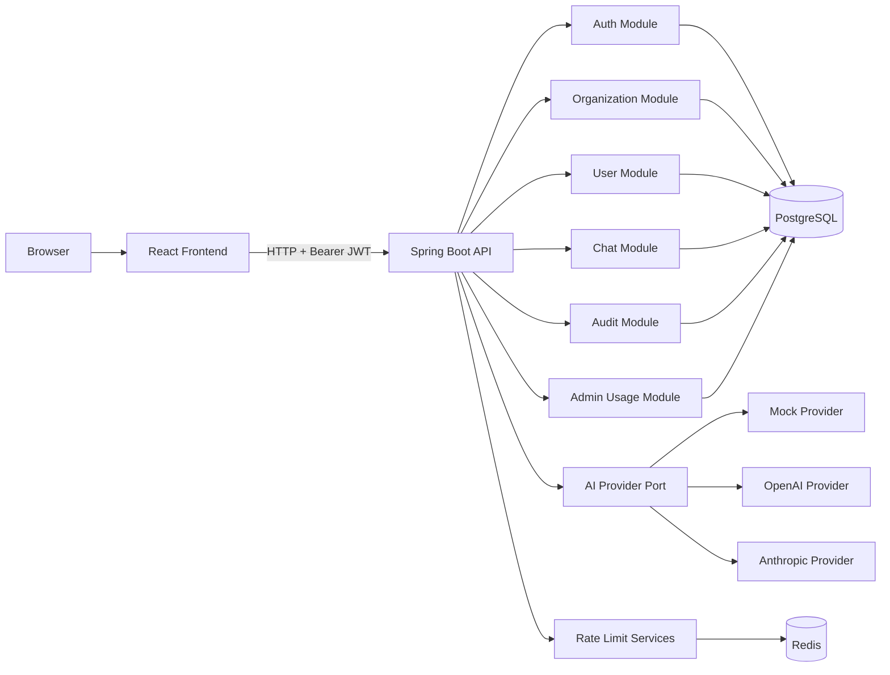
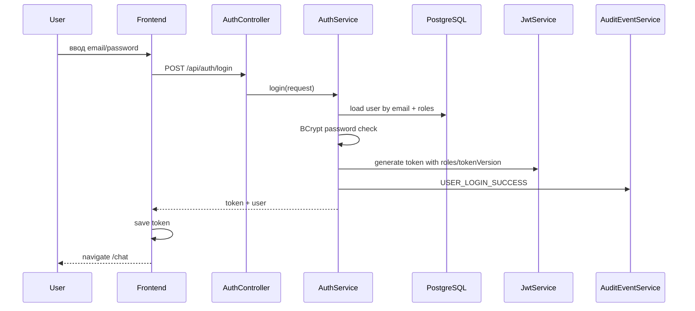
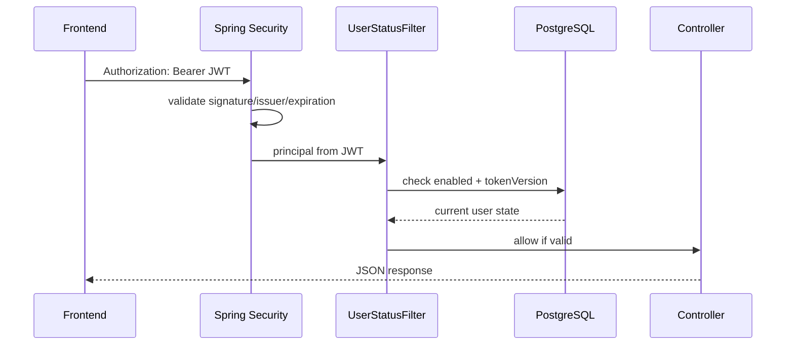
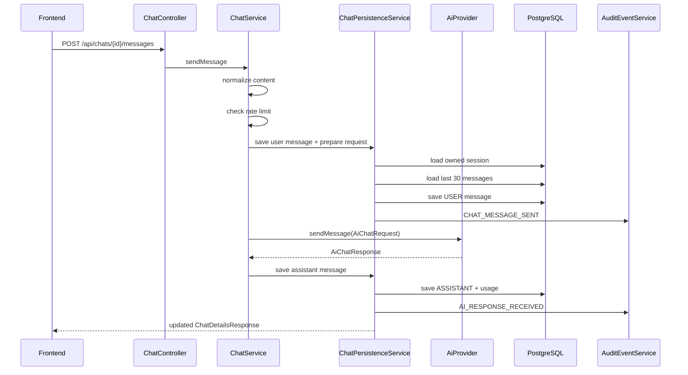
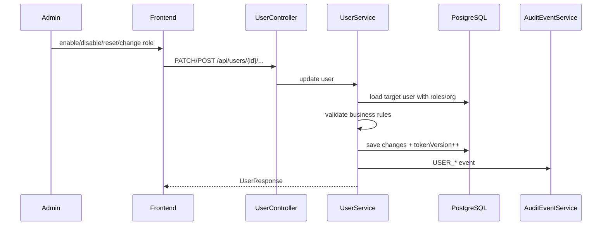
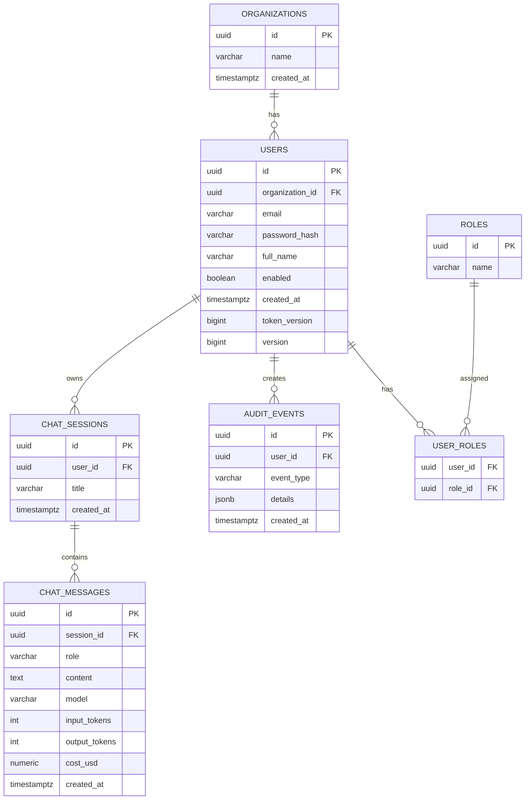

# SafeAI Desk

**SafeAI Desk** — full-stack MVP корпоративного AI Gateway: внутренний шлюз для безопасного использования AI сотрудниками организации с авторизацией, ролями, чатами, audit events, usage-статистикой, подключаемыми AI-провайдерами и Redis-инфраструктурой для лимитов.

Проект построен как портфолио/interview-ready система: не просто CRUD, а полноценный backend/frontend продукт с security, multi-tenancy, audit, usage tracking и provider abstraction.

---

## Содержание

1. [Кратко о проекте](#кратко-о-проекте)
2. [Текущий статус](#текущий-статус)
3. [Что уже реализовано](#что-уже-реализовано)
4. [Что еще нужно сделать](#что-еще-нужно-сделать)
5. [Технологический стек](#технологический-стек)
6. [Ролевая модель](#ролевая-модель)
7. [Архитектура](#архитектура)
8. [Runtime flow](#runtime-flow)
9. [Структура проекта](#структура-проекта)
10. [Backend-модули](#backend-модули)
11. [Frontend-модули](#frontend-модули)
12. [Схема базы данных](#схема-базы-данных)
13. [Flyway migrations](#flyway-migrations)
14. [Security model](#security-model)
15. [API endpoints](#api-endpoints)
16. [AI providers](#ai-providers)
17. [Rate limiting](#rate-limiting)
18. [Audit и usage](#audit-и-usage)
19. [Локальный запуск](#локальный-запуск)
20. [Docker запуск](#docker-запуск)
21. [Environment variables](#environment-variables)
22. [Frontend build](#frontend-build)
23. [Ручная проверка API](#ручная-проверка-api)
24. [Проверка базы данных](#проверка-базы-данных)
25. [Тесты](#тесты)
26. [Troubleshooting](#troubleshooting)
27. [Production gaps](#production-gaps)
28. [Roadmap](#roadmap)
29. [Формулировка для собеседования](#формулировка-для-собеседования)

---

## Кратко о проекте

SafeAI Desk позволяет сотрудникам работать с AI через контролируемый корпоративный шлюз.

Основная идея:

```text
User
  ↓
React + TypeScript frontend
  ↓
Spring Boot backend
  ↓
Auth / Users / Organizations / Chat / AI / Audit / Usage
  ↓
PostgreSQL + Redis
  ↓
Mock / OpenAI / Anthropic provider
```

Проект решает несколько задач:

```text
- централизованный доступ сотрудников к AI;
- разделение пользователей по организациям;
- управление пользователями и ролями;
- хранение истории чатов;
- учет token usage и стоимости;
- audit trail для security и admin actions;
- abstraction layer для разных AI-провайдеров;
- подготовка к rate limiting, force logout, RAG и production deployment.
```

---

## Текущий статус

Текущий статус: **рабочий full-stack MVP**.

Уровень зрелости:

```text
Backend core:       крепкий MVP
Frontend:           рабочий admin/chat prototype
Security:           базовая JWT/RBAC модель реализована
Multi-tenancy:      реализована частично, требует hardening в admin/audit usage
AI providers:       mock работает, OpenAI/Anthropic требуют live verification
Production-ready:   пока нет, есть список production gaps
```

Главная актуальная архитектурная модель проекта:

```text
SUPER_ADMIN / ADMIN / USER
```

Важно: роль `SUPER_ADMIN` уже добавлена миграцией `V9__add_super_admin_role.sql`, поэтому документация должна рассматривать проект как систему с тремя ролями.

---

## Что уже реализовано

### Backend

```text
✅ Java 21 backend
✅ Spring Boot 4
✅ Spring Web MVC REST API
✅ Spring Security
✅ JWT authentication
✅ OAuth2 Resource Server JWT validation
✅ BCrypt password hashing
✅ Role-based access control
✅ Custom JSON 401/403 responses
✅ GlobalExceptionHandler
✅ RequestIdFilter + X-Request-Id
✅ UserStatusFilter: проверка enabled/tokenVersion на каждом authenticated request
✅ Organizations
✅ Users
✅ Roles
✅ Admin user management
✅ Chat sessions
✅ Chat messages
✅ AI provider abstraction
✅ MockAiProvider
✅ OpenAiProvider scaffold
✅ AnthropicProvider scaffold
✅ Audit events
✅ Usage aggregation
✅ Redis login rate limiting
✅ Redis AI-message rate limiting
✅ PostgreSQL persistence
✅ Flyway migrations
✅ JPA ddl-auto validate
✅ Tests structure
```

### Frontend

```text
✅ React + TypeScript frontend
✅ Vite dev server
✅ React Router routes
✅ Login page
✅ Chat page
✅ Admin Users page
✅ Admin Audit page
✅ Admin Usage page
✅ API layer через fetch wrapper
✅ localStorage token storage
✅ Authorization Bearer token injection
✅ token cleanup on 401
✅ protected routes
✅ admin-only routes
✅ role-aware topbar
✅ current user display
✅ user actions: enable/disable, reset password, change role
```

### Infrastructure

```text
✅ Docker Compose для PostgreSQL и Redis
✅ PostgreSQL 16
✅ Redis 7
✅ Backend Dockerfile multi-stage build
✅ Maven wrapper
✅ .env / .env.example pattern
✅ scripts для локального запуска
```

---

## Что еще нужно сделать

Критичные задачи перед дальнейшим развитием:

```text
P0:
- выровнять SUPER_ADMIN / ADMIN / USER во всех backend security rules;
- исправить tenant isolation в Admin Usage endpoints;
- исправить tenant isolation в Audit endpoints;
- добавить organization_id в audit_events;
- исправить frontend Audit API contract: backend Page vs frontend Array;
- убрать hardcoded DEMO_ORGANIZATION_ID из frontend;
- добавить REDIS_HOST=redis в docker-compose backend environment;
- добавить handler для RateLimitUnavailableException;
- проверить, что frontend не отправляет Authorization header на /api/auth/login.
```

Важные задачи после P0:

```text
P1:
- Redis rate limit сделать атомарным через Lua script или TTL recovery;
- login rate limit вынести в application.yml;
- добавить organization-scoped daily usage queries;
- добавить case-insensitive unique index на users.email;
- добавить DB constraints для chat_messages;
- добавить provider cost calculation;
- добавить OpenAI/Anthropic live verification;
- добавить retry/backoff policy для AI providers;
- добавить pagination/date range для audit и usage;
- улучшить frontend role model под SUPER_ADMIN;
- заменить reset password prompt на modal/form.
```

Дальше:

```text
P2:
- RAG: document upload, indexing, retrieval;
- streaming AI responses через SSE/WebSocket;
- organization-level budgets;
- production Docker profile;
- CI pipeline;
- deployment documentation;
- observability/metrics/tracing;
- HttpOnly cookie auth для production-grade web security.
```

---

## Технологический стек

### Backend

```text
Java 21
Spring Boot 4.0.6
Spring Web MVC
Spring Security
Spring OAuth2 Resource Server
Spring Data JPA / Hibernate
Flyway
PostgreSQL
Redis
Maven
Lombok
JUnit / Spring Boot Test / Testcontainers
```

### Frontend

```text
React 19
TypeScript 6
Vite 8
React Router 7
Fetch API
CSS
```

### Infrastructure

```text
Docker
Docker Compose
PostgreSQL 16
Redis 7
Eclipse Temurin 21 Docker images
```

---

## Ролевая модель

Актуальная модель должна быть такой:

```text
SUPER_ADMIN
- platform-level администратор SafeAI Desk;
- управляет организациями;
- видит global audit/usage;
- может создавать пользователей в любой организации;
- может назначать ADMIN/USER;
- потенциально управляет platform settings.

ADMIN
- администратор конкретной организации;
- видит только свою организацию;
- управляет пользователями только своей организации;
- смотрит audit/usage только своей организации;
- не должен создавать организации;
- не должен видеть чужие данные.

USER
- обычный пользователь;
- работает только с chat;
- видит только свои chat sessions/messages;
- не имеет доступа к admin endpoints.
```

Требуемая security-семантика:

```text
SUPER_ADMIN → global scope
ADMIN       → organization scope
USER        → own resources only
```

---

## Архитектура



Архитектурные принципы:

```text
- frontend не знает про БД и AI providers;
- backend закрывает все бизнес-правила и security checks;
- chat не зависит от конкретного AI provider;
- AI provider выбирается через configuration property;
- audit пишется отдельным сервисом;
- usage считается на основе assistant messages;
- Redis используется для rate limits и будущего token revocation.
```

---

## Runtime flow

### Login flow



### Authenticated request flow



Важно:

```text
Старые токены disabled user или пользователя с измененным tokenVersion должны становиться недействительными.
Это уже реализуется через UserStatusFilter.
```

### Chat message flow



Особенность:

```text
Внешний AI-вызов выполняется вне долгой database transaction.
Это защищает connection pool от зависания во время network call.
```

### Admin user-management flow



---

## Структура проекта

По текущей структуре проект выглядит так:

```text
```text
Safeai-desk/
├── backend/
│   ├── .idea/
│   ├── .mvn/
│   ├── src/
│   │   ├── main/
│   │   │   ├── java/ru/safeai/gateway/
│   │   │   │   ├── admin/
│   │   │   │   ├── ai/
│   │   │   │   ├── audit/
│   │   │   │   ├── auth/
│   │   │   │   ├── chat/
│   │   │   │   ├── common/
│   │   │   │   ├── organization/
│   │   │   │   ├── ratelimit/
│   │   │   │   ├── user/
│   │   │   │   └── SafeaiBackendApplication.java
│   │   │   └── resources/
│   │   │       ├── application.yml
│   │   │       ├── static/
│   │   │       ├── templates/
│   │   │       └── db/migration/
│   │   │           ├── V1__init_schema.sql
│   │   │           ├── V2__seed_roles.sql
│   │   │           ├── V3__seed_demo_admin.sql
│   │   │           ├── V4__use_timestamptz_for_created_at.sql
│   │   │           ├── V5__add_indexes.sql
│   │   │           ├── V6__add_unique_organization_name.sql
│   │   │           ├── V7__add_user_token_version.sql
│   │   │           ├── V8__add_audit_event_type_index.sql
│   │   │           ├── V9__add_super_admin_role.sql
│   │   │           ├── V10__add_case_insensitive_user_email_index.sql
│   │   │           ├── V11__seed_platform_super_admin.sql
│   │   │           ├── V12__seed_platform_super_admin.sql
│   │   │           └── V13__add_audit_event_organization_id.sql
│   │   └── test/
│   │       ├── java/ru/safeai/gateway/
│   │       │   ├── admin/
│   │       │   ├── ai/
│   │       │   ├── audit/
│   │       │   ├── auth/
│   │       │   ├── chat/
│   │       │   ├── common/
│   │       │   ├── organization/
│   │       │   ├── ratelimit/
│   │       │   ├── user/
│   │       │   └── SafeaiBackendApplicationTests.java
│   │       └── resources/
│   │           └── application-test.yml
│   ├── .env
│   ├── .env.example
│   ├── Dockerfile
│   ├── mvnw
│   ├── mvnw.cmd
│   └── pom.xml
│
├── frontend/
│   ├── src/
│   │   ├── api/
│   │   ├── pages/
│   │   ├── App.tsx
│   │   ├── global.d.ts
│   │   ├── index.css
│   │   ├── main.tsx
│   │   └── vite-env.d.ts
│   ├── index.html
│   ├── package.json
│   ├── package-lock.json
│   ├── tsconfig.app.json
│   ├── tsconfig.json
│   ├── tsconfig.node.json
│   └── vite.config.ts
│
├── infra/
│   └── docker-compose.yml
│
├── scripts/
│   ├── check-health.bat
│   ├── full-docker-up.bat
│   ├── psql-audit-events.bat
│   ├── run-backend-local.bat
│   ├── run-infra.bat
│   └── stop-infra.bat
│
├── docs/
├── .gitignore
└── README.md
```


---

## Backend-модули

```text
```text
ru.safeai.gateway
├── admin
│   ├── controller
│   │   └── AdminUsageController
│   └── service
│       └── AdminUsageService
│
├── ai
│   ├── AiChatRequest
│   ├── AiChatResponse
│   ├── AiConfiguration
│   ├── AiExceptionHandler
│   ├── AiMessage
│   ├── AiProvider
│   ├── AiProviderException
│   ├── AiProviderProperties
│   ├── AiProviderSupport
│   ├── AiProviderTimeoutException
│   ├── AiRestClientFactory
│   ├── AnthropicProperties
│   ├── AnthropicProvider
│   ├── MockAiProvider
│   ├── OpenAiProperties
│   └── OpenAiProvider
│
├── audit
│   ├── controller
│   │   └── AuditController
│   ├── dto
│   │   └── AuditEventResponse
│   ├── entity
│   │   └── AuditEventEntity
│   ├── listener
│   │   └── RateLimitAuditListener
│   ├── repository
│   │   └── AuditEventRepository
│   ├── service
│   │   ├── AuditEventQueryService
│   │   └── AuditEventService
│   └── AuditEventType
│
├── auth
│   ├── controller
│   │   └── AuthController
│   ├── dto
│   │   ├── AuthUserResponse
│   │   ├── CurrentUserResponse
│   │   ├── LoginRequest
│   │   └── LoginResponse
│   ├── mapper
│   │   └── AuthUserMapper
│   ├── security
│   │   ├── CustomUserDetailsService
│   │   ├── SecurityConfig
│   │   └── UserStatusFilter
│   └── service
│       ├── AuthEventService
│       └── AuthService
│
├── chat
│   ├── controller
│   │   └── ChatController
│   ├── dto
│   │   ├── ChatDetailsResponse
│   │   ├── ChatResponse
│   │   ├── CreateChatRequest
│   │   ├── MessageResponse
│   │   ├── SendMessageRequest
│   │   ├── UsageDailySummaryResponse
│   │   ├── UsageModelSummaryResponse
│   │   ├── UsageSummaryResponse
│   │   └── UsageUserSummaryResponse
│   ├── entity
│   │   ├── ChatMessageEntity
│   │   ├── ChatMessageRole
│   │   └── ChatSessionEntity
│   ├── repository
│   │   ├── ChatMessageRepository
│   │   ├── ChatSessionRepository
│   │   └── UsageDailySummaryProjection
│   └── service
│       ├── ChatMapper
│       ├── ChatPersistenceService
│       ├── ChatProcessingContext
│       └── ChatService
│
├── common
│   ├── exception
│   │   ├── ApiErrorResponse
│   │   ├── ApiErrorResponseFactory
│   │   ├── ConflictException
│   │   ├── ForbiddenOperationException
│   │   ├── GlobalExceptionHandler
│   │   ├── RateLimitExceededException
│   │   ├── RateLimitUnavailableException
│   │   └── ResourceNotFoundException
│   └── security
│       ├── ClientIpResolver
│       ├── CorsProperties
│       ├── JsonAccessDeniedHandler
│       ├── JsonAuthenticationEntryPoint
│       ├── JsonSecurityErrorWriter
│       ├── JwtProperties
│       ├── JwtService
│       ├── RequestIdFilter
│       ├── RoleAuthorityMapper
│       ├── SafeAiJwtAuthenticationConverter
│       └── SafeAiUserPrincipal
│
├── organization
│   ├── controller
│   │   └── OrganizationController
│   ├── dto
│   │   ├── CreateOrganizationRequest
│   │   └── OrganizationResponse
│   ├── entity
│   │   └── OrganizationEntity
│   ├── repository
│   │   └── OrganizationRepository
│   └── service
│       └── OrganizationService
│
├── ratelimit
│   ├── AiMessageRateLimitProperties
│   ├── LoginRateLimitProperties
│   ├── LoginRateLimitService
│   ├── RateLimitExceededEvent
│   ├── RedisFixedWindowRateLimiter
│   └── RedisRateLimitService
│
└── user
    ├── controller
    │   └── UserController
    ├── dto
    │   ├── CreateUserRequest
    │   ├── ResetUserPasswordRequest
    │   ├── UpdateUserEnabledRequest
    │   ├── UpdateUserRolesRequest
    │   └── UserResponse
    ├── entity
    │   ├── RoleEntity
    │   └── UserEntity
    ├── event
    │   └── UserSecurityStateChangedEvent
    ├── repository
    │   ├── RoleRepository
    │   └── UserRepository
    └── service
        ├── UserSecurityStatus
        ├── UserService
        ├── UserStatusCacheInvalidationListener
        ├── UserStatusCacheProperties
        └── UserStatusCacheService
```


### Назначение модулей

| Модуль | Назначение |
|---|---|
| `auth` | login, текущий пользователь, JWT выдача, audit login events |
| `common.security` | SecurityConfig, JWT, principal, requestId, JSON 401/403, UserStatusFilter |
| `common.exception` | единый формат API ошибок |
| `common.ratelimit` | Redis login/AI-message rate limits |
| `organization` | организации, platform-level управление |
| `user` | пользователи, роли, enable/disable, reset password |
| `chat` | chat sessions/messages, сохранение usage |
| `ai` | AI provider abstraction и реализации |
| `audit` | запись и чтение audit events |
| `admin` | usage dashboards/aggregation endpoints |

---

## Frontend-модули

```text
frontend/src
├── api/
│   ├── adminApi.ts
│   ├── authApi.ts
│   ├── chatApi.ts
│   ├── http.ts
│   └── userApi.ts
├── pages/
│   ├── AdminAuditPage.tsx
│   ├── AdminUsagePage.tsx
│   ├── AdminUsersPage.tsx
│   ├── ChatPage.tsx
│   └── LoginPage.tsx
├── App.tsx
├── global.d.ts
├── index.css
├── main.tsx
└── vite-env.d.ts
```

### Назначение frontend-файлов

| Файл | Назначение |
|---|---|
| `api/http.ts` | общий `apiRequest`, token handling, ApiError |
| `api/authApi.ts` | login и `/api/auth/me` |
| `api/chatApi.ts` | CRUD чатов и отправка сообщений |
| `api/userApi.ts` | admin user-management actions |
| `api/adminApi.ts` | audit и usage APIs |
| `App.tsx` | routes, protected routes, topbar |
| `LoginPage.tsx` | login form |
| `ChatPage.tsx` | список чатов и сообщения |
| `AdminUsersPage.tsx` | пользователи, роли, enable/disable, reset password |
| `AdminAuditPage.tsx` | audit events |
| `AdminUsagePage.tsx` | usage summary |

---

## Схема базы данных



### Таблицы

| Таблица | Назначение |
|---|---|
| `organizations` | организации/компании |
| `users` | пользователи, password hash, enabled, tokenVersion |
| `roles` | роли `SUPER_ADMIN`, `ADMIN`, `USER` |
| `user_roles` | many-to-many users ↔ roles |
| `chat_sessions` | чаты пользователя |
| `chat_messages` | сообщения + AI usage |
| `audit_events` | журнал security/admin/system events |

### Важный будущий DB hardening

Следующая рекомендуемая миграция должна добавить:

```text
- audit_events.organization_id;
- unique index lower(users.email);
- usage indexes;
- check constraints для chat_messages.role/input_tokens/output_tokens/cost_usd;
- возможно default now() для created_at.
```

---

## Flyway migrations

Файлы миграций:

```text
backend/src/main/resources/db/migration/
├── V1__init_schema.sql
├── V2__seed_roles.sql
├── V3__seed_demo_admin.sql
├── V4__use_timestamptz_for_created_at.sql
├── V5__add_indexes.sql
├── V6__add_unique_organization_name.sql
├── V7__add_user_token_version_and_version.sql
├── V8__add_audit_event_type_index.sql
└── V9__add_super_admin_role.sql
```

### Что делают миграции

| Migration | Назначение |
|---|---|
| `V1` | базовая схема: organizations, users, roles, chats, audit |
| `V2` | seed ролей `ADMIN`, `USER` |
| `V3` | seed `Demo Company` и `admin@test.com` |
| `V4` | перевод `created_at` в `timestamptz` |
| `V5` | базовые индексы |
| `V6` | unique index `lower(organizations.name)` |
| `V7` | `users.token_version`, `users.version` |
| `V8` | индекс по audit event type |
| `V9` | роль `SUPER_ADMIN`, назначение demo admin |

Правило Flyway:

```text
Уже примененные миграции не редактируются.
Любое изменение схемы — только через новую V10/V11/... migration.
```

---

## Security model

### JWT claims

JWT содержит:

```text
issuer
issuedAt
expiresAt
subject=email
userId
organizationId
roles
tokenVersion
```

### Token invalidation

`UserStatusFilter` на каждом authenticated request проверяет:

```text
1. пользователь существует;
2. user.enabled == true;
3. user.tokenVersion == token.tokenVersion.
```

Это означает:

```text
- disabled user теряет доступ старым JWT;
- reset password инвалидирует старые JWT;
- change roles инвалидирует старые JWT;
- tokenVersion можно использовать для force logout.
```

### Access rules

Требуемая целевая модель:

| Endpoint | Access |
|---|---|
| `POST /api/auth/login` | public |
| `GET /actuator/health` | public |
| `/api/chats/**` | authenticated |
| `/api/users/**` | `ADMIN` или `SUPER_ADMIN` |
| `POST /api/organizations` | `SUPER_ADMIN` |
| `GET /api/organizations/**` | `ADMIN` или `SUPER_ADMIN` |
| `/api/admin/**` | `ADMIN` или `SUPER_ADMIN`, но с разным data scope |
| all other endpoints | authenticated |

Data scope:

```text
SUPER_ADMIN → global
ADMIN       → current organization only
USER        → own chats only
```

Важно: если текущий `SecurityConfig` еще требует только `hasRole("ADMIN")` для некоторых `/api/admin/**` или `/api/organizations/**`, его нужно привести к этой модели.

---

## API endpoints

### Auth

| Method | Endpoint | Access | Назначение |
|---|---|---|---|
| `POST` | `/api/auth/login` | public | login, выдача JWT |
| `GET` | `/api/auth/me` | authenticated | текущий пользователь |

### Organizations

| Method | Endpoint | Access | Назначение |
|---|---|---|---|
| `POST` | `/api/organizations` | `SUPER_ADMIN` | создать организацию |
| `GET` | `/api/organizations` | `ADMIN`/`SUPER_ADMIN` | список организаций по scope |
| `GET` | `/api/organizations/{id}` | `ADMIN`/`SUPER_ADMIN` | организация по id |

### Users

| Method | Endpoint | Access | Назначение |
|---|---|---|---|
| `POST` | `/api/users` | `ADMIN`/`SUPER_ADMIN` | создать пользователя |
| `GET` | `/api/users` | `ADMIN`/`SUPER_ADMIN` | список пользователей |
| `GET` | `/api/users/{id}` | `ADMIN`/`SUPER_ADMIN` | пользователь по id |
| `PATCH` | `/api/users/{id}/enabled` | `ADMIN`/`SUPER_ADMIN` | enable/disable |
| `PATCH` | `/api/users/{id}/roles` | `ADMIN`/`SUPER_ADMIN` | смена ролей |
| `POST` | `/api/users/{id}/reset-password` | `ADMIN`/`SUPER_ADMIN` | сброс пароля |

### Chats

| Method | Endpoint | Access | Назначение |
|---|---|---|---|
| `POST` | `/api/chats` | authenticated | создать чат |
| `GET` | `/api/chats` | authenticated | мои чаты |
| `GET` | `/api/chats/{id}` | owner only | чат с сообщениями |
| `POST` | `/api/chats/{id}/messages` | owner only | отправить сообщение |

### Admin Audit

| Method | Endpoint | Access | Назначение |
|---|---|---|---|
| `GET` | `/api/admin/audit-events` | `ADMIN`/`SUPER_ADMIN` | audit events |
| `GET` | `/api/admin/audit-events/users/{userId}` | `ADMIN`/`SUPER_ADMIN` | audit по user |

Требуемый scope:

```text
SUPER_ADMIN → все события
ADMIN       → только события своей организации
```

### Admin Usage

| Method | Endpoint | Access | Назначение |
|---|---|---|---|
| `GET` | `/api/admin/usage-summary` | legacy | старый endpoint |
| `GET` | `/api/admin/usage/summary` | `ADMIN`/`SUPER_ADMIN` | usage by user + model |
| `GET` | `/api/admin/usage/users` | `ADMIN`/`SUPER_ADMIN` | usage by users |
| `GET` | `/api/admin/usage/models` | `ADMIN`/`SUPER_ADMIN` | usage by models |
| `GET` | `/api/admin/usage/daily` | `ADMIN`/`SUPER_ADMIN` | daily usage |
| `GET` | `/api/admin/usage/by-user/{userId}` | `ADMIN`/`SUPER_ADMIN` | usage конкретного user |
| `GET` | `/api/admin/usage/by-organization/{organizationId}` | `ADMIN`/`SUPER_ADMIN` | usage организации |

Требуемый scope:

```text
SUPER_ADMIN → global usage
ADMIN       → usage своей organization only
```

---

## AI providers

AI layer построен через порт:

```java
public interface AiProvider {
    AiChatResponse sendMessage(AiChatRequest request);
}
```

Реализации:

```text
MockAiProvider
OpenAiProvider
AnthropicProvider
```

Provider выбирается конфигурацией:

```yaml
safeai:
  ai:
    provider: ${SAFEAI_AI_PROVIDER:mock}
```

Доступные значения:

```text
mock
openai
anthropic
```

### Mock

```env
SAFEAI_AI_PROVIDER=mock
```

Плюсы:

```text
- не нужен API key;
- можно локально тестировать весь chat flow;
- возвращает deterministic mock response;
- считает примерные input/output tokens.
```

### OpenAI

```env
SAFEAI_AI_PROVIDER=openai
OPENAI_API_KEY=sk-...
OPENAI_MODEL=gpt-4.1
```

Текущий статус:

```text
Реализация есть, требуется live verification.
Нужно добавить max_output_tokens, retry/backoff, cost calculation, latency logging.
```

### Anthropic

```env
SAFEAI_AI_PROVIDER=anthropic
ANTHROPIC_API_KEY=sk-ant-...
ANTHROPIC_MODEL=claude-opus-4-8
ANTHROPIC_MAX_TOKENS=1024
```

Текущий статус:

```text
Реализация есть, требуется live verification.
Нужно улучшить handling system prompt и parsing multi-block text response.
```

---

## Rate limiting

Реализовано:

```text
- Redis login rate limit;
- Redis AI-message rate limit;
- разные лимиты USER/ADMIN;
- audit event RATE_LIMIT_EXCEEDED для AI-message limit.
```

Текущая конфигурация AI-message limits:

```yaml
safeai:
  rate-limit:
    ai-messages:
      enabled: true
      user-limit-per-hour: 20
      admin-limit-per-hour: 100
```

Текущие login limits в коде:

```text
email: 10 attempts / 10 minutes
ip:    30 attempts / 10 minutes
```

Что нужно улучшить:

```text
- сделать Redis INCR+EXPIRE атомарным через Lua;
- вынести login limits в application.yml;
- добавить RateLimitUnavailableException handler;
- добавить Retry-After header;
- не списывать AI quota до проверки ownership чата;
- добавить organization-level AI limits.
```

---

## Audit и usage

### Audit

Audit events хранятся в:

```text
audit_events
```

Текущие event types:

```text
USER_LOGIN_SUCCESS
USER_LOGIN_FAILED
CHAT_CREATED
CHAT_MESSAGE_SENT
AI_RESPONSE_RECEIVED
AI_RESPONSE_FAILED
USER_CREATED
ORGANIZATION_CREATED
USER_ENABLED_CHANGED
USER_ROLES_CHANGED
USER_PASSWORD_RESET
RATE_LIMIT_EXCEEDED
```

Audit details хранятся в `jsonb`.

Важно:

```text
В audit не сохраняется содержимое chat messages.
Для CHAT_MESSAGE_SENT сохраняется messageLength, но не сам prompt.
```

Требуемое улучшение:

```text
Добавить audit_events.organization_id для безопасного organization-scoped audit.
```

### Usage

Usage сохраняется в assistant messages:

```text
chat_messages.model
chat_messages.input_tokens
chat_messages.output_tokens
chat_messages.cost_usd
```

Агрегации:

```text
- by user + model;
- by user;
- by model;
- by day;
- by organization;
- by specific user.
```

Требуемое улучшение:

```text
ADMIN должен видеть usage только своей organization.
SUPER_ADMIN может видеть global usage.
```

---

## Локальный запуск

### Требования

```text
Java 21
Docker Desktop
Node.js >= 20.19
npm
Git
```

### 1. Запустить infrastructure

```bat
cd /d "D:\Java projects\Safeai-desk\infra"
docker compose up -d postgres redis
docker ps
```

Ожидаемые контейнеры:

```text
safeai-postgres
safeai-redis
```

### 2. Запустить backend локально

```bat
cd /d "D:\Java projects\Safeai-desk\backend"

set SAFEAI_JWT_SECRET=safeai-local-development-secret-key-change-this-value-please-123456789
set SAFEAI_JWT_EXPIRATION_MINUTES=60
set SAFEAI_AI_PROVIDER=mock
set REDIS_HOST=localhost
set REDIS_PORT=6379

mvnw.cmd spring-boot:run
```

Backend:

```text
http://localhost:8080
```

Health check:

```bat
curl -i http://localhost:8080/actuator/health
```

### 3. Запустить frontend

```bat
cd /d "D:\Java projects\Safeai-desk\frontend"
npm install
npm run dev
```

Frontend:

```text
http://localhost:5173/login
```

---

## Docker запуск

### Только infrastructure

```bat
cd /d "D:\Java projects\Safeai-desk\infra"
docker compose up -d postgres redis
```

### Полный запуск через profile

Backend в compose находится в profile `full`, поэтому запуск:

```bat
cd /d "D:\Java projects\Safeai-desk\infra"
docker compose --profile full up --build
```

Важно для backend container:

```yaml
environment:
  SPRING_DATASOURCE_URL: jdbc:postgresql://postgres:5432/safeai
  SPRING_DATASOURCE_USERNAME: safeai
  SPRING_DATASOURCE_PASSWORD: safeai_password
  REDIS_HOST: redis
  REDIS_PORT: 6379
```

Если `REDIS_HOST=redis` не задан, backend внутри Docker будет пытаться подключиться к Redis на `localhost`, то есть внутри самого backend container.

---

## Environment variables

### Backend required

```env
SAFEAI_JWT_SECRET=safeai-local-development-secret-key-change-this-value-please-123456789
```

JWT secret должен быть минимум 32 байта для HS256.

### Backend optional

```env
SAFEAI_JWT_EXPIRATION_MINUTES=60
SAFEAI_JWT_ISSUER=safeai-desk
SAFEAI_CORS_ALLOWED_ORIGINS=http://localhost:5173

SPRING_DATASOURCE_URL=jdbc:postgresql://localhost:5432/safeai
SPRING_DATASOURCE_USERNAME=safeai
SPRING_DATASOURCE_PASSWORD=safeai_password

REDIS_HOST=localhost
REDIS_PORT=6379
REDIS_PASSWORD=
```

### AI

```env
SAFEAI_AI_PROVIDER=mock

OPENAI_BASE_URL=https://api.openai.com/v1
OPENAI_API_KEY=
OPENAI_MODEL=gpt-4.1

ANTHROPIC_BASE_URL=https://api.anthropic.com/v1
ANTHROPIC_API_KEY=
ANTHROPIC_MODEL=claude-opus-4-8
ANTHROPIC_VERSION=2023-06-01
ANTHROPIC_MAX_TOKENS=1024
```

### Recommended `.env.example`

```env
SPRING_DATASOURCE_URL=jdbc:postgresql://localhost:5432/safeai
SPRING_DATASOURCE_USERNAME=safeai
SPRING_DATASOURCE_PASSWORD=safeai_password

REDIS_HOST=localhost
REDIS_PORT=6379
REDIS_PASSWORD=

SAFEAI_JWT_SECRET=change-me-change-me-change-me-32-bytes-minimum
SAFEAI_JWT_EXPIRATION_MINUTES=60
SAFEAI_JWT_ISSUER=safeai-desk

SAFEAI_CORS_ALLOWED_ORIGINS=http://localhost:5173

SAFEAI_AI_PROVIDER=mock

OPENAI_BASE_URL=https://api.openai.com/v1
OPENAI_API_KEY=
OPENAI_MODEL=gpt-4.1

ANTHROPIC_BASE_URL=https://api.anthropic.com/v1
ANTHROPIC_API_KEY=
ANTHROPIC_MODEL=claude-opus-4-8
ANTHROPIC_VERSION=2023-06-01
ANTHROPIC_MAX_TOKENS=1024
```

Не коммитить реальные `.env` и API keys.

---

## Frontend build

```bat
cd /d "D:\Java projects\Safeai-desk\frontend"
npm run build
```

Проверка production build:

```bat
npm run preview
```

Vite dev proxy настроен так:

```ts
server: {
  proxy: {
    '/api': {
      target: 'http://localhost:8080',
      changeOrigin: true,
    },
    '/actuator': {
      target: 'http://localhost:8080',
      changeOrigin: true,
    },
  },
}
```

---

## Ручная проверка API

### Login

```bat
curl -i -X POST http://localhost:8080/api/auth/login ^
  -H "Content-Type: application/json" ^
  -d "{\"email\":\"admin@test.com\",\"password\":\"admin123\"}"
```

Сохранить token:

```bat
set "TOKEN=PASTE_TOKEN_HERE"
```

### Current user

```bat
curl -i http://localhost:8080/api/auth/me ^
  -H "Authorization: Bearer %TOKEN%"
```

### Create chat

```bat
curl -i -X POST http://localhost:8080/api/chats ^
  -H "Content-Type: application/json" ^
  -H "Authorization: Bearer %TOKEN%" ^
  -d "{\"title\":\"Test chat\"}"
```

### Send message

```bat
curl -i -X POST http://localhost:8080/api/chats/CHAT_ID/messages ^
  -H "Content-Type: application/json" ^
  -H "Authorization: Bearer %TOKEN%" ^
  -d "{\"content\":\"Привет, проверь AI\"}"
```

Ожидаемо для mock provider:

```text
Mock AI provider response: Привет, проверь AI
```

### Users

```bat
curl -i http://localhost:8080/api/users ^
  -H "Authorization: Bearer %TOKEN%"
```

### Audit

```bat
curl -i http://localhost:8080/api/admin/audit-events ^
  -H "Authorization: Bearer %TOKEN%"
```

### Usage

```bat
curl -i http://localhost:8080/api/admin/usage/summary ^
  -H "Authorization: Bearer %TOKEN%"
```

---

## Проверка базы данных

### Flyway history

```bat
docker exec -it safeai-postgres psql -U safeai -d safeai -c "select installed_rank, version, description, success from flyway_schema_history order by installed_rank;"
```

### Users

```bat
docker exec -it safeai-postgres psql -U safeai -d safeai -c "select id, email, enabled, token_version, version from users order by created_at desc;"
```

### Roles

```bat
docker exec -it safeai-postgres psql -U safeai -d safeai -c "select u.email, r.name from users u join user_roles ur on ur.user_id = u.id join roles r on r.id = ur.role_id order by u.email, r.name;"
```

### Chat messages

```bat
docker exec -it safeai-postgres psql -U safeai -d safeai -c "select role, model, input_tokens, output_tokens, cost_usd, created_at from chat_messages order by created_at desc limit 10;"
```

### Audit events

```bat
docker exec -it safeai-postgres psql -U safeai -d safeai -c "select event_type, user_id, created_at, details from audit_events order by created_at desc limit 10;"
```

---

## Тесты

Backend:

```bat
cd /d "D:\Java projects\Safeai-desk\backend"
mvnw.cmd clean test
```

Frontend:

```bat
cd /d "D:\Java projects\Safeai-desk\frontend"
npm run build
```

Test tree содержит проверки для:

```text
admin controller/service
ai mock provider
audit controller/service
auth controller/service
chat controller/service
common.security
organization controller/service
user module
application context
```

---

## Troubleshooting

### Backend не стартует из-за `SAFEAI_JWT_SECRET`

Причина:

```text
SAFEAI_JWT_SECRET не задан или меньше 32 байт.
```

Решение:

```bat
set SAFEAI_JWT_SECRET=safeai-local-development-secret-key-change-this-value-please-123456789
```

### Backend в Docker не подключается к Redis

Причина:

```text
REDIS_HOST не задан, default localhost внутри backend container неправильный.
```

Решение в `infra/docker-compose.yml`:

```yaml
environment:
  REDIS_HOST: redis
  REDIS_PORT: 6379
```

### Frontend audit page падает `events.map is not a function`

Причина:

```text
Backend возвращает Page<AuditEventResponse>, а frontend ожидает AuditEvent[].
```

Решение:

```text
Frontend должен читать response.content.
```

### Login возвращает 401

Возможные причины:

```text
- неверный email/password;
- user disabled;
- старый tokenVersion;
- frontend отправляет старый Authorization header на /api/auth/login.
```

Решение:

```text
- проверить пароль;
- проверить users.enabled;
- очистить localStorage.safeai_token;
- сделать login request без Authorization header.
```

### User disabled, но старый token больше не работает

Это ожидаемо и правильно:

```text
UserStatusFilter проверяет enabled/tokenVersion на каждом authenticated request.
```

### Ошибка Flyway checksum

Причина:

```text
Была изменена уже примененная migration.
```

Правильное решение:

```text
Не редактировать старую migration.
Добавить новую V10/V11 migration.
```

---

## Production gaps

Этот проект пока не production-ready. Основные gaps:

```text
Security / RBAC:
- выровнять SUPER_ADMIN access во всех слоях;
- запретить global usage/audit обычному ADMIN;
- добавить organization_id в audit_events;
- добавить tests на tenant isolation.

Rate limit:
- atomic Redis rate limit;
- Retry-After header;
- handler RateLimitUnavailableException;
- login rate limit properties.

Frontend:
- audit Page contract;
- убрать hardcoded org id;
- SUPER_ADMIN-aware UI;
- auth loading state;
- reset password modal;
- package-lock sync.

AI providers:
- live verification OpenAI/Anthropic;
- cost calculation;
- retry/backoff;
- better output parsing;
- max output tokens;
- safety/moderation layer.

Database:
- unique lower(users.email);
- audit organization index;
- usage indexes;
- check constraints;
- created_at default now().

Infrastructure:
- Redis healthcheck;
- backend healthcheck;
- non-root Docker user;
- production compose profile;
- CI pipeline;
- deployment docs.
```

---

## Roadmap

### Stage 1 — Security hardening

```text
1. SUPER_ADMIN/ADMIN/USER model alignment
2. Admin Usage tenant isolation
3. Audit tenant isolation
4. audit_events.organization_id
5. SecurityConfig fixes
6. frontend SUPER_ADMIN support
```

### Stage 2 — Rate limit hardening

```text
1. atomic Redis Lua script
2. Retry-After
3. login rate-limit config
4. org-level AI limits
5. better 429 UI
```

### Stage 3 — AI provider production hardening

```text
1. OpenAI live verification
2. Anthropic live verification
3. cost calculation
4. retries/backoff
5. latency/error logging
6. provider request IDs
```

### Stage 4 — Admin analytics

```text
1. usage charts
2. date range filters
3. pagination
4. export CSV
5. org/user/model filters
```

### Stage 5 — RAG

```text
1. document upload
2. document parsing
3. embeddings
4. vector storage
5. retrieval
6. prompt context injection
7. document access control
```

### Stage 6 — Production deployment

```text
1. production Docker profile
2. reverse proxy
3. HTTPS
4. CI/CD
5. monitoring
6. structured logging
7. backup strategy
```

---

## Формулировка для собеседования

```text
SafeAI Desk — это full-stack MVP корпоративного AI Gateway. Я реализовал Spring Boot backend на Java 21 с JWT-авторизацией, ролями SUPER_ADMIN/ADMIN/USER, организациями, пользователями, управлением пользователями, chat sessions, messages, audit events и usage tracking. 

Ключевая архитектурная идея — chat-модуль не зависит от конкретного AI-провайдера. Он работает через интерфейс AiProvider, а конкретная реализация выбирается конфигурацией: Mock, OpenAI или Anthropic. Это позволяет локально разрабатывать через mock provider и отдельно подключать реальные provider integrations.

В security-части реализованы BCrypt, JWT, OAuth2 Resource Server validation, custom JSON 401/403, tokenVersion и проверка enabled/tokenVersion на каждом authenticated request. Это позволяет инвалидировать старые JWT после disable, reset password или изменения ролей.

Admin часть позволяет управлять пользователями: создавать пользователей, включать/отключать, менять роли и сбрасывать пароль. Все важные действия пишутся в audit. Usage сохраняется на уровне assistant messages и агрегируется по пользователям, моделям, дням и организациям.

Frontend реализован на React + TypeScript: login, chat, admin users, audit и usage pages. Инфраструктура поднимается через Docker Compose с PostgreSQL и Redis. Следующие этапы — hardening multi-tenant isolation, production-grade rate limiting, live verification OpenAI/Anthropic, RAG и production deployment.
```

---

## Git hygiene

Не коммитить:

```text
backend/.env
.env
*.env
backend/target/
frontend/node_modules/
frontend/dist/
.idea/
docs/local/
*.local.md
API keys
production secrets
temporary files
```

Можно коммитить:

```text
README.md
README_RU.md
docs/*.md
backend/.env.example
backend/src/**
backend/pom.xml
frontend/src/**
frontend/package.json
frontend/package-lock.json
infra/docker-compose.yml
scripts/*.bat
```

Перед commit:

```bat
cd /d "D:\Java projects\Safeai-desk\backend"
mvnw.cmd clean test
```

```bat
cd /d "D:\Java projects\Safeai-desk\frontend"
npm run build
```
