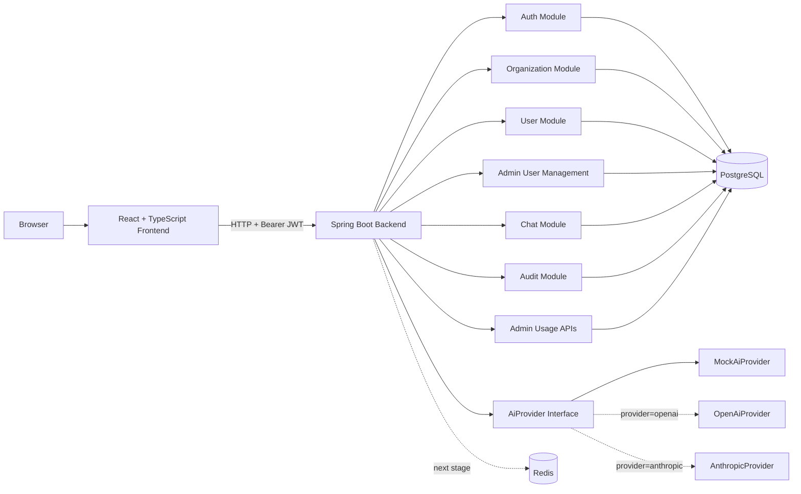
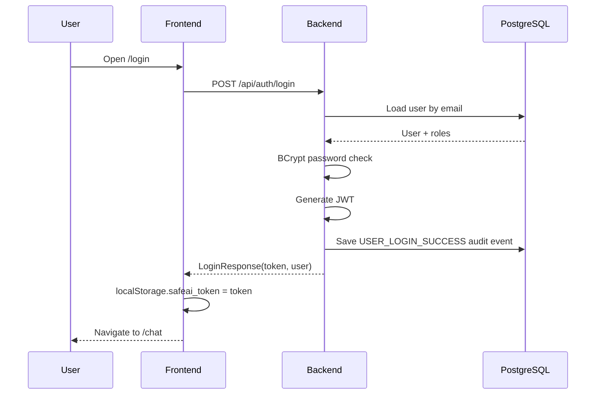
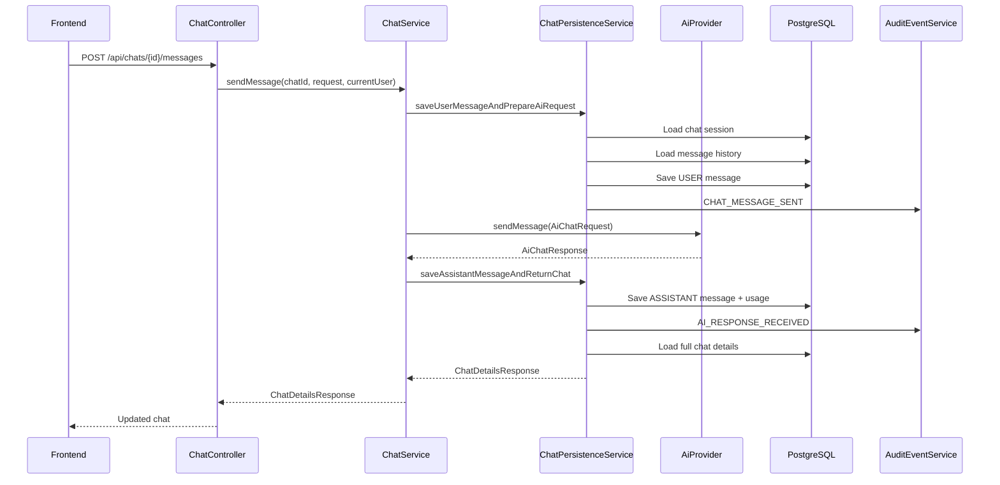
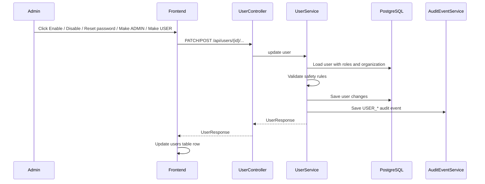
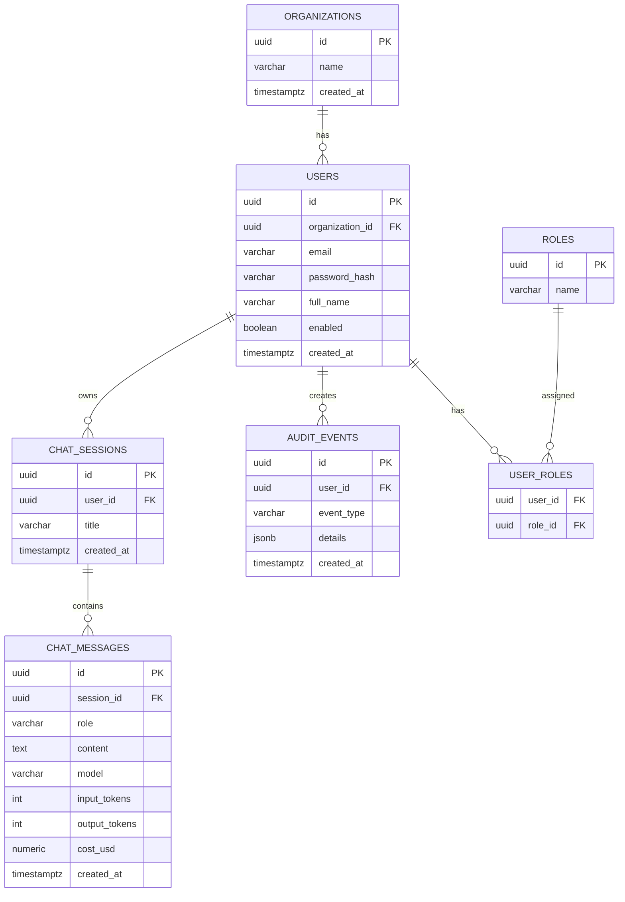
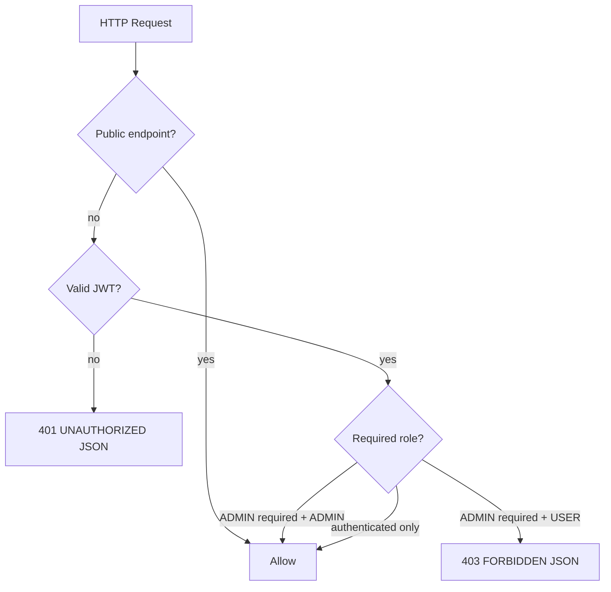

# SafeAI Desk

SafeAI Desk — это рабочий full-stack MVP корпоративного AI Gateway.

Проект позволяет сотрудникам использовать AI через контролируемый внутренний шлюз, а организации — управлять пользователями, ролями, историей чатов, audit events, usage-статистикой, настройкой AI-провайдеров, будущими лимитами и RAG-сценариями на основе документов.

Текущий статус: **рабочий full-stack MVP**.

---

## 1. Что делает проект

SafeAI Desk предоставляет:

```text
- JWT-авторизацию
- роли ADMIN / USER
- управление организациями и пользователями
- создание пользователей через admin UI
- включение и отключение пользователей
- сброс забытых паролей
- изменение ролей USER / ADMIN
- chat sessions и chat messages
- абстракцию AI-провайдера
- Mock AI provider для локальной разработки
- заготовку OpenAI provider
- заготовку Anthropic provider
- audit events
- учет usage по токенам и стоимости
- React + TypeScript frontend/admin UI
- Redis-ready инфраструктуру для будущих rate limits и token revocation
```

Основной runtime-flow:

```text
Пользователь
  ↓
React frontend
  ↓
Spring Boot API
  ↓
Auth / User Management / Chat / AI Provider / Audit / Usage
  ↓
PostgreSQL + Redis
```

---

## 2. Текущий статус MVP

Реализовано:

```text
✅ Spring Boot backend
✅ React + TypeScript frontend
✅ локальная инфраструктура PostgreSQL и Redis
✅ Flyway database migrations
✅ Organization API
✅ User API
✅ Admin user-management API
✅ роли ADMIN / USER
✅ BCrypt password hashing
✅ JWT authentication
✅ OAuth2 Resource Server JWT validation
✅ JSON-ответы для 401/403/API ошибок
✅ chat sessions и messages
✅ AI provider abstraction
✅ MockAiProvider
✅ OpenAiProvider scaffold
✅ AnthropicProvider scaffold
✅ Audit events
✅ Admin Audit API
✅ Usage tracking
✅ Admin Usage APIs
✅ Frontend login
✅ Frontend chat
✅ Frontend admin users
✅ Frontend admin audit
✅ Frontend admin usage
✅ Protected frontend routes
✅ Admin-only frontend routes
✅ Role-aware topbar
✅ Current user display
✅ User action buttons: enable/disable, reset password, change role
✅ очистка frontend token при 401
✅ backend unit/security tests
✅ frontend production build
```

Следующий большой этап:

```text
➡️ Rate limits через Redis
```

---

## 3. Технологический стек

### Backend

```text
Java 21
Spring Boot 4
Spring Web MVC
Spring Security
OAuth2 Resource Server JWT
Spring Data JPA
Flyway
PostgreSQL
Redis
Maven
```

### Frontend

```text
React
TypeScript
Vite
React Router
Fetch API
```

### Infrastructure

```text
Docker Compose
PostgreSQL 16
Redis 7
```

---

## 4. Общая архитектура



Смысл схемы:

```text
- frontend работает через HTTP API;
- frontend передает JWT в Authorization: Bearer <token>;
- backend проверяет JWT через Spring Security;
- backend ограничивает доступ по ролям ADMIN / USER;
- бизнес-модули сохраняют данные в PostgreSQL;
- AI вызывается через общий интерфейс AiProvider;
- конкретный provider выбирается через environment variable;
- Redis уже есть в инфраструктуре и будет использоваться для rate limits и будущего force logout/token revocation.
```

---

## 5. Runtime request flow

### 5.1. Login flow



Пояснение:

```text
1. Пользователь вводит email/password.
2. Backend ищет пользователя в БД.
3. Пароль проверяется через BCrypt.
4. При успехе backend генерирует JWT.
5. Login success пишется в audit_events.
6. Frontend сохраняет token в localStorage.
7. Дальше frontend отправляет token во всех защищенных запросах.
```

### 5.2. Chat message flow



Пояснение:

```text
1. USER message сохраняется до вызова AI.
2. Внешний вызов AI выполняется вне долгой database transaction.
3. ASSISTANT message сохраняется после ответа provider.
4. Usage-поля сохраняются в chat_messages.
5. Audit events пишутся отдельно.
```

### 5.3. Admin user-management flow



Пояснение:

```text
- Disable не удаляет пользователя, а ставит enabled=false.
- Reset password не показывает старый пароль, а задаёт новый passwordHash.
- Make ADMIN / Make USER меняет роль пользователя.
- Все действия пишутся в audit.
- Backend защищает последнего активного ADMIN.
```

---

## 6. Структура проекта

```text
Safeai-desk/
├── backend/
│   ├── src/main/java/ru/safeai/gateway/
│   │   ├── admin/
│   │   ├── ai/
│   │   ├── audit/
│   │   ├── auth/
│   │   ├── chat/
│   │   ├── common/
│   │   │   ├── exception/
│   │   │   └── security/
│   │   ├── organization/
│   │   └── user/
│   ├── src/main/resources/
│   │   ├── application.yml
│   │   └── db/migration/
│   ├── src/test/java/
│   ├── .env.example
│   └── pom.xml
├── frontend/
│   ├── src/
│   │   ├── api/
│   │   ├── pages/
│   │   ├── App.tsx
│   │   ├── index.css
│   │   └── main.tsx
│   ├── index.html
│   ├── package.json
│   ├── tsconfig.json
│   └── vite.config.ts
├── infra/
│   └── docker-compose.yml
├── docs/
│   ├── 12_ROADMAP.md
│   └── local/
│       └── TEST_ACCOUNTS.local.md    # local only, not committed
└── README.md
```

---

## 7. Структура backend packages

```text
ru.safeai.gateway
├── admin
│   ├── controller
│   └── service
├── ai
│   ├── AiProvider
│   ├── MockAiProvider
│   ├── OpenAiProvider
│   ├── AnthropicProvider
│   └── provider DTO/support classes
├── audit
│   ├── controller
│   ├── dto
│   ├── entity
│   ├── repository
│   └── service
├── auth
│   ├── controller
│   ├── dto
│   └── service
├── chat
│   ├── controller
│   ├── dto
│   ├── entity
│   ├── repository
│   └── service
├── common
│   ├── exception
│   └── security
├── organization
│   ├── controller
│   ├── dto
│   ├── entity
│   ├── repository
│   └── service
└── user
    ├── controller
    ├── dto
    ├── entity
    ├── repository
    └── service
```

Назначение основных модулей:

```text
auth          login, /me, JWT выдача
common        общие ошибки, security config, JWT converter, principal
organization  организации
user          пользователи, роли и admin user-management
chat          чаты, сообщения, история
ai            интерфейс AI provider и реализации mock/openai/anthropic
audit         запись и чтение audit events
admin         usage aggregation endpoints
```

---

## 8. Структура frontend

```text
frontend/src
├── api
│   ├── adminApi.ts
│   ├── authApi.ts
│   ├── chatApi.ts
│   ├── http.ts
│   └── userApi.ts
├── pages
│   ├── AdminAuditPage.tsx
│   ├── AdminUsagePage.tsx
│   ├── AdminUsersPage.tsx
│   ├── ChatPage.tsx
│   └── LoginPage.tsx
├── App.tsx
├── global.d.ts
├── index.css
├── main.tsx
└── vite-env.d.ts
```

Назначение frontend-частей:

```text
api/http.ts       общий fetch wrapper, token injection, token cleanup on 401
api/authApi.ts    login и getCurrentUser
api/chatApi.ts    chats и messages
api/adminApi.ts   audit и usage
api/userApi.ts    users + admin user-management actions
pages/*           страницы интерфейса
App.tsx           routes, topbar, protected routes, admin-only routes
vite.config.ts    Vite dev proxy на backend localhost:8080
```

---

## 9. Схема базы данных



Ключевые таблицы:

```text
organizations  организации клиентов/компаний
users          пользователи системы
roles          роли ADMIN / USER
user_roles     many-to-many связь пользователей и ролей
chat_sessions  отдельные чаты пользователя
chat_messages  сообщения чатов + usage-поля
audit_events   журнал действий пользователей и системы
```

---

## 10. Flyway migrations

Директория миграций:

```text
backend/src/main/resources/db/migration
```

Текущие миграции:

```text
V1__init_schema.sql
V2__seed_roles.sql
V3__seed_demo_admin.sql
V4__use_timestamptz_for_created_at.sql
V5__add_indexes.sql
V6__add_unique_organization_name.sql
```

Важное правило:

```text
Нельзя редактировать уже примененные Flyway migrations.
Если нужно изменить схему — добавляется новая миграция V{number}__description.sql.
```

Seed data:

```text
Organization: Demo Company
Admin email:  admin@test.com
Admin pass:   admin123
Role:         ADMIN
```

Пароли хранятся только как BCrypt hashes. Обычный пароль `admin123` в базе храниться не должен.

---

## 11. Environment variables

Создать локальный backend env-файл:

```bat
cd /d "D:\Java projects\Safeai-desk\backend"
copy .env.example .env
```

Пример локальной mock-конфигурации:

```env
SAFEAI_JWT_SECRET=safeai-local-development-secret-key-change-this-value-please-123456789
SAFEAI_JWT_EXPIRATION_MINUTES=60

SAFEAI_AI_PROVIDER=mock

OPENAI_BASE_URL=https://api.openai.com/v1
OPENAI_API_KEY=
OPENAI_MODEL=gpt-4.1

ANTHROPIC_BASE_URL=https://api.anthropic.com/v1
ANTHROPIC_API_KEY=
ANTHROPIC_MODEL=claude-opus-4-8
ANTHROPIC_VERSION=2023-06-01
ANTHROPIC_MAX_TOKENS=1024
```

Реальные `.env` файлы и API keys нельзя коммитить.

Ожидаемые `.gitignore` entries:

```gitignore
backend/.env
.env
*.env
!*.env.example
backend/target/
frontend/node_modules/
frontend/dist/
.idea/
docs/local/
*.local.md
```

---

## 12. Выбор AI provider

Provider выбирается через environment variable:

```env
SAFEAI_AI_PROVIDER=mock
```

Доступные значения:

```text
mock
openai
anthropic
```

### Mock provider

```env
SAFEAI_AI_PROVIDER=mock
```

Используется для локальной разработки. API key не нужен.

### OpenAI provider

```env
SAFEAI_AI_PROVIDER=openai
OPENAI_API_KEY=sk-...
OPENAI_MODEL=gpt-4.1
```

### Anthropic provider

```env
SAFEAI_AI_PROVIDER=anthropic
ANTHROPIC_API_KEY=sk-ant-...
ANTHROPIC_MODEL=claude-opus-4-8
ANTHROPIC_MAX_TOKENS=1024
```

Текущий статус:

```text
Mock provider проверен локально.
OpenAI и Anthropic providers реализованы как configurable scaffolds.
Live-проверка OpenAI/Anthropic требует валидных API keys.
```

---

## 13. Локальное подключение к базе данных

PostgreSQL запускается в Docker.

Default local connection:

```text
Name: SafeAI PostgreSQL Local
Host: localhost
Port: 5432
Database: safeai
Username: safeai
Password: safeai_password
```

JDBC URL, если backend запускается локально на хосте:

```text
jdbc:postgresql://localhost:5432/safeai
```

JDBC URL, если backend запускается внутри Docker Compose:

```text
jdbc:postgresql://postgres:5432/safeai
```

---

## 14. Локальный запуск разработки

Для локальной разработки используется 3 терминала.

### Terminal 1 — infrastructure

```bat
cd /d "D:\Java projects\Safeai-desk\infra"
docker compose up -d postgres redis
docker ps
```

Ожидаемые контейнеры:

```text
safeai-postgres
safeai-redis
```

### Terminal 2 — backend

```bat
cd /d "D:\Java projects\Safeai-desk\backend"

set SAFEAI_JWT_SECRET=safeai-local-development-secret-key-change-this-value-please-123456789
set SAFEAI_JWT_EXPIRATION_MINUTES=60
set SAFEAI_AI_PROVIDER=mock

mvnw.cmd spring-boot:run
```

Backend URL:

```text
http://localhost:8080
```

Health check:

```bat
curl -i http://localhost:8080/actuator/health
```

Ожидаемо:

```text
HTTP/1.1 200
```

```json
{"groups":["liveness","readiness"],"status":"UP"}
```

### Terminal 3 — frontend

```bat
cd /d "D:\Java projects\Safeai-desk\frontend"
npm run dev
```

Frontend URL:

```text
http://localhost:5173/login
```

---

## 15. Frontend build

```bat
cd /d "D:\Java projects\Safeai-desk\frontend"
npm run build
```

Ожидаемо:

```text
✓ built in ...
```

Build output:

```text
frontend/dist
```

`npm run build` только собирает frontend. Он не запускает сайт.

Для локальной разработки использовать:

```bat
npm run dev
```

Для проверки production build локально:

```bat
npm run preview
```

---

## 16. API endpoints

### Public

```text
POST /api/auth/login
GET  /actuator/health
```

### Auth

```text
POST /api/auth/login
GET  /api/auth/me
```

### Organizations

```text
POST /api/organizations
GET  /api/organizations
GET  /api/organizations/{id}
```

### Users

```text
POST  /api/users
GET   /api/users
GET   /api/users/{id}
PATCH /api/users/{id}/enabled
PATCH /api/users/{id}/roles
POST  /api/users/{id}/reset-password
```

### Chats

```text
POST /api/chats
GET  /api/chats
GET  /api/chats/{id}
POST /api/chats/{id}/messages
```

### Admin Audit

```text
GET /api/admin/audit-events
GET /api/admin/audit-events/users/{userId}
```

### Admin Usage

```text
GET /api/admin/usage-summary
GET /api/admin/usage/summary
GET /api/admin/usage/users
GET /api/admin/usage/models
GET /api/admin/usage/daily
GET /api/admin/usage/by-user/{userId}
GET /api/admin/usage/by-organization/{organizationId}
```

`/api/admin/usage-summary` оставлен как старый совместимый endpoint. Основной новый endpoint:

```text
GET /api/admin/usage/summary
```

---

## 17. Security rules



Правила доступа:

```text
POST /api/auth/login        public
GET  /actuator/health       public
/api/chats/**               authenticated
/api/users/**               ADMIN
/api/organizations/**       ADMIN
/api/admin/**               ADMIN
all other endpoints         authenticated
```

Обычный USER может:

```text
✅ войти через /login
✅ открыть /chat
✅ создать свой чат
✅ смотреть только свои чаты
✅ отправлять сообщения в AI
```

Обычный USER не может:

```text
❌ смотреть /admin/users
❌ смотреть /admin/audit
❌ смотреть /admin/usage
❌ управлять другими пользователями
```

---

## 18. Admin user-management

На странице:

```text
/admin/users
```

ADMIN может:

```text
✅ создать USER
✅ создать ADMIN
✅ отфильтровать All / Admins / Users
✅ отключить пользователя через Disable
✅ включить пользователя через Enable
✅ сбросить пароль через Reset password
✅ повысить USER до ADMIN через Make ADMIN
✅ понизить ADMIN до USER через Make USER
```

Что делают кнопки:

```text
Disable        → PATCH /api/users/{id}/enabled        { "enabled": false }
Enable         → PATCH /api/users/{id}/enabled        { "enabled": true }
Reset password → POST  /api/users/{id}/reset-password { "password": "..." }
Make ADMIN     → PATCH /api/users/{id}/roles          { "roles": ["ADMIN"] }
Make USER      → PATCH /api/users/{id}/roles          { "roles": ["USER"] }
```

Backend-защита:

```text
- нельзя отключить самого себя;
- нельзя снять ADMIN-роль с самого себя;
- нельзя отключить последнего активного ADMIN;
- нельзя снять ADMIN-роль с последнего активного ADMIN;
- USER не может вызывать эти endpoints.
```

Audit events:

```text
USER_ENABLED_CHANGED
USER_ROLES_CHANGED
USER_PASSWORD_RESET
```

Важно про пароли:

```text
Старый пароль посмотреть нельзя.
Если пароль забыт, админ задаёт новый пароль через Reset password.
В БД хранится BCrypt hash, а не обычный пароль.
```

Важно про отключение:

```text
Disable запрещает новый login.
Но уже выданный JWT может работать до истечения срока жизни токена.
Для мгновенного force logout нужен будущий Redis token revocation.
```

---

## 19. Ручная проверка API

### Login

Windows CMD:

```bat
curl -i -X POST http://localhost:8080/api/auth/login ^
  -H "Content-Type: application/json" ^
  -d "{\"email\":\"admin@test.com\",\"password\":\"admin123\"}"
```

Ожидаемо:

```text
HTTP/1.1 200
```

Ответ содержит:

```json
{
  "token": "eyJ...",
  "tokenType": "Bearer",
  "user": {
    "email": "admin@test.com",
    "enabled": true,
    "roles": ["ADMIN"]
  }
}
```

Сохранить token:

```bat
set "TOKEN=PASTE_TOKEN_HERE"
```

### Current user

```bat
curl -i http://localhost:8080/api/auth/me ^
  -H "Authorization: Bearer %TOKEN%"
```

Ожидаемо:

```text
HTTP/1.1 200
```

### Create chat

```bat
curl -X POST http://localhost:8080/api/chats ^
  -H "Content-Type: application/json" ^
  -H "Authorization: Bearer %TOKEN%" ^
  -d "{\"title\":\"Test chat\"}"
```

Сохранить chat id:

```bat
set "CHAT_ID=PASTE_CHAT_ID_HERE"
```

### Send message

```bat
curl -X POST http://localhost:8080/api/chats/%CHAT_ID%/messages ^
  -H "Content-Type: application/json" ^
  -H "Authorization: Bearer %TOKEN%" ^
  -d "{\"content\":\"Привет, проверь AI\"}"
```

Ожидаемый assistant content:

```text
Mock AI provider response: Привет, проверь AI
```

### Disable user

```bat
curl -i -X PATCH http://localhost:8080/api/users/USER_ID/enabled ^
  -H "Authorization: Bearer %TOKEN%" ^
  -H "Content-Type: application/json" ^
  -d "{\"enabled\":false}"
```

### Enable user

```bat
curl -i -X PATCH http://localhost:8080/api/users/USER_ID/enabled ^
  -H "Authorization: Bearer %TOKEN%" ^
  -H "Content-Type: application/json" ^
  -d "{\"enabled\":true}"
```

### Change role

```bat
curl -i -X PATCH http://localhost:8080/api/users/USER_ID/roles ^
  -H "Authorization: Bearer %TOKEN%" ^
  -H "Content-Type: application/json" ^
  -d "{\"roles\":[\"ADMIN\"]}"
```

### Reset password

```bat
curl -i -X POST http://localhost:8080/api/users/USER_ID/reset-password ^
  -H "Authorization: Bearer %TOKEN%" ^
  -H "Content-Type: application/json" ^
  -d "{\"password\":\"NewPass123\"}"
```

### Audit

```bat
curl http://localhost:8080/api/admin/audit-events ^
  -H "Authorization: Bearer %TOKEN%"
```

Ожидаемые events:

```text
USER_LOGIN_SUCCESS
CHAT_CREATED
CHAT_MESSAGE_SENT
AI_RESPONSE_RECEIVED
USER_ENABLED_CHANGED
USER_ROLES_CHANGED
USER_PASSWORD_RESET
```

### Usage

```bat
curl http://localhost:8080/api/admin/usage/summary ^
  -H "Authorization: Bearer %TOKEN%"
```

Ожидаемые поля:

```text
userEmail
model
inputTokens
outputTokens
totalTokens
costUsd
```

### Protected endpoint без token

```bat
curl http://localhost:8080/api/chats
```

Ожидаемо:

```json
{
  "status": 401,
  "error": "UNAUTHORIZED"
}
```

---

## 20. Проверка frontend

Открыть:

```text
http://localhost:5173/login
```

Проверить ADMIN flow:

```text
1. Login as admin@test.com / admin123
2. В topbar видно текущий email и ADMIN
3. /chat открывается после login
4. Create chat
5. Send message
6. Появляется Mock AI response
7. /admin/users показывает пользователей
8. Create user работает
9. Confirm password проверяется на frontend
10. Disable / Enable работают
11. Reset password работает
12. Make ADMIN / Make USER работают
13. Фильтры All / Admins / Users работают
14. /admin/audit показывает audit events
15. /admin/usage показывает usage summary
16. Logout возвращает на /login
17. Открытие /chat без token перекидывает на /login
```

Проверить USER flow:

```text
1. Login as обычный USER
2. В topbar видно email и USER
3. В меню виден только Chat
4. Users / Audit / Usage не видны
5. /chat работает
6. Ручной переход на /admin/users возвращает на /chat или получает 403 на backend
```

---

## 21. Проверка базы данных

### Flyway history

```bat
docker exec -it safeai-postgres psql -U safeai -d safeai -c "select installed_rank, version, description, success from flyway_schema_history order by installed_rank;"
```

Ожидаемо:

```text
1 | 1 | init schema
2 | 2 | seed roles
3 | 3 | seed demo admin
4 | 4 | use timestamptz for created at
5 | 5 | add indexes
6 | 6 | add unique organization name
```

### Users

```bat
docker exec -it safeai-postgres psql -U safeai -d safeai -c "select email, enabled, created_at from users;"
```

### User roles

```bat
docker exec -it safeai-postgres psql -U safeai -d safeai -c "select u.email, r.name from users u join user_roles ur on ur.user_id = u.id join roles r on r.id = ur.role_id order by u.email;"
```

### Chat messages

```bat
docker exec -it safeai-postgres psql -U safeai -d safeai -c "select role, model, input_tokens, output_tokens, cost_usd from chat_messages order by created_at desc limit 10;"
```

### Audit events

```bat
docker exec -it safeai-postgres psql -U safeai -d safeai -c "select event_type, user_id, created_at from audit_events order by created_at desc limit 10;"
```

---

## 22. Запуск тестов

Backend:

```bat
cd /d "D:\Java projects\Safeai-desk\backend"
mvnw.cmd clean test
```

Frontend:

```bat
cd /d "D:\Java projects\Safeai-desk\frontend"
npm run build
```

Ожидаемо:

```text
BUILD SUCCESS
✓ built in ...
```

---

## 23. Полезные команды

### Запустить infrastructure

```bat
cd /d "D:\Java projects\Safeai-desk\infra"
docker compose up -d postgres redis
```

### Остановить containers

```bat
cd /d "D:\Java projects\Safeai-desk\infra"
docker compose stop
```

### Удалить containers, но оставить volumes

```bat
cd /d "D:\Java projects\Safeai-desk\infra"
docker compose down
```

### Удалить containers и данные базы

```bat
cd /d "D:\Java projects\Safeai-desk\infra"
docker compose down -v
```

`down -v` использовать осторожно: он удаляет локальные PostgreSQL data.

### Посмотреть containers

```bat
docker ps
```

### Посмотреть logs

```bat
docker logs safeai-postgres
docker logs safeai-redis
```

---

## 24. Локальные тестовые аккаунты

Для локальной разработки можно создать файл:

```text
docs/local/TEST_ACCOUNTS.local.md
```

В нём можно хранить тестовые email/password, которые нужны только тебе при локальной проверке.

Этот файл нельзя коммитить. В `.gitignore` должны быть строки:

```gitignore
docs/local/
*.local.md
```

Почему так:

```text
- в production пароли нельзя хранить в документации;
- в Git нельзя коммитить пароли и секреты;
- в базе пароли должны быть только в виде BCrypt hashes;
- если пароль забыт, его нельзя посмотреть, можно только сбросить через Reset password.
```

---

## 25. Troubleshooting

### `SAFEAI_JWT_SECRET` is not set

Причина:

```text
Spring Boot не читает backend/.env автоматически при запуске через mvnw.cmd spring-boot:run.
```

Исправление в Windows CMD:

```bat
set SAFEAI_JWT_SECRET=safeai-local-development-secret-key-change-this-value-please-123456789
set SAFEAI_JWT_EXPIRATION_MINUTES=60
set SAFEAI_AI_PROVIDER=mock
```

Потом запуск:

```bat
mvnw.cmd spring-boot:run
```

### `ERR_CONNECTION_REFUSED` на localhost:5173

Причина:

```text
npm run build только собирает frontend.
Он не запускает Vite dev server.
```

Исправление:

```bat
cd /d "D:\Java projects\Safeai-desk\frontend"
npm run dev
```

### Login возвращает 400 BAD_REQUEST

Возможная причина:

```text
frontend отправляет тело login-запроса не как JSON object.
```

Правильно:

```json
{
  "email": "admin@test.com",
  "password": "admin123"
}
```

В `LoginPage.tsx` вызов должен быть таким:

```ts
const response = await login({
    email: email.trim(),
    password,
})
```

### Login возвращает 401 UNAUTHORIZED

Это значит:

```text
email/password неверные
или пользователь disabled
```

Если пароль забыт:

```text
ADMIN → /admin/users → Reset password
```

### Backend не подключается к PostgreSQL

Если backend запускается локально:

```text
jdbc:postgresql://localhost:5432/safeai
```

Если backend запускается в Docker:

```text
jdbc:postgresql://postgres:5432/safeai
```

Проверка:

```bat
docker ps
```

### Port 8080 is already in use

Остановить локальный backend:

```text
Ctrl + C
```

Или остановить Docker backend, если он используется:

```bat
cd /d "D:\Java projects\Safeai-desk\infra"
docker compose stop backend
```

### Token is malformed

Правильно:

```text
Authorization: Bearer eyJ...
```

Неправильно:

```text
Authorization: Bearer "token":"eyJ..."
```

### Token expired или удален

Frontend должен удалить token при `401` и защищенные routes должны перекидывать пользователя на `/login`.

### Disabled user still works with an old token

Это ожидаемо для текущего MVP:

```text
Disable запрещает новый login.
Старый JWT может работать до истечения срока жизни токена.
```

Будущее улучшение:

```text
Redis token revocation / force logout
```

---

## 26. Commit checklist

Перед commit:

```bat
cd /d "D:\Java projects\Safeai-desk"
git status
```

Запустить:

```bat
cd /d "D:\Java projects\Safeai-desk\backend"
mvnw.cmd clean test
```

```bat
cd /d "D:\Java projects\Safeai-desk\frontend"
npm run build
```

Не коммитить:

```text
backend/.env
.env
*.env
backend/target/
frontend/node_modules/
frontend/dist/
.idea/
docs/local/
*.local.md
API keys
production secrets
temporary files
```

Можно коммитить:

```text
README.md
docs/*.md
backend/.env.example
backend/src/**
frontend/src/**
infra/docker-compose.yml
```

Для текущего этапа хороший commit message:

```text
feat: add admin user management
```

Для обновления документации:

```text
docs: update roadmap and README
```

---

## 27. Development roadmap

Следующие этапы:

```text
1. Rate limits через Redis                         next
2. Redis token revocation / force logout           pending
3. OpenAI live verification                        pending
4. Anthropic live verification                     pending
5. Provider timeout/retry/error handling           pending
6. Better frontend error UI                        pending
7. Admin usage charts                              pending
8. Document upload                                 pending
9. RAG indexing and retrieval                      pending
10. Production Docker profile                      pending
11. CI pipeline                                    pending
12. Deployment documentation                       pending
```

Уже сделано:

```text
✅ User management actions: enable/disable, roles, reset password
✅ Frontend buttons for user management
✅ Current user display
✅ Admin menu hiding for USER
✅ Audit events for user management
```

---

## 28. Формулировка для собеседования

```text
SafeAI Desk — это full-stack MVP корпоративного AI Gateway. Я реализовал Spring Boot backend с организациями, пользователями, ролями, JWT-авторизацией, chat sessions, абстракцией AI-провайдера, mock provider, заготовками OpenAI/Anthropic providers, audit events и usage tracking. Модуль chat не зависит от конкретного AI-провайдера, потому что работает через интерфейс AiProvider.

Admin APIs показывают users, audit events и usage analytics. Для администраторов реализованы user-management actions: создание пользователей, enable/disable, reset password и смена ролей USER/ADMIN. Backend защищает критические сценарии: нельзя отключить самого себя, нельзя снять с себя ADMIN, нельзя оставить систему без активного администратора. Все административные действия пишутся в audit.

Usage сохраняется в chat_messages и агрегируется по пользователю, модели и дням. Также реализован React + TypeScript frontend: login, chat, admin users, admin audit и admin usage. Frontend показывает текущего пользователя и роль, скрывает admin menu для обычного USER и даёт админу кнопки управления пользователями. Следующий этап — rate limiting через Redis, затем token revocation, live-проверка реальных AI-провайдеров и RAG.
```
