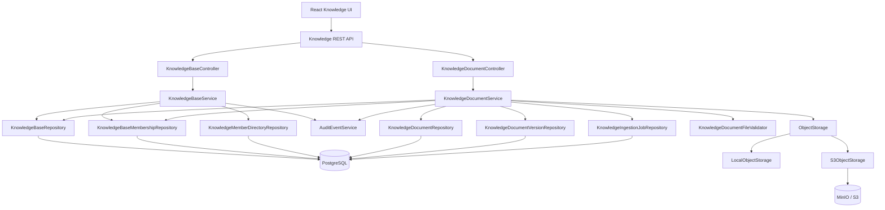
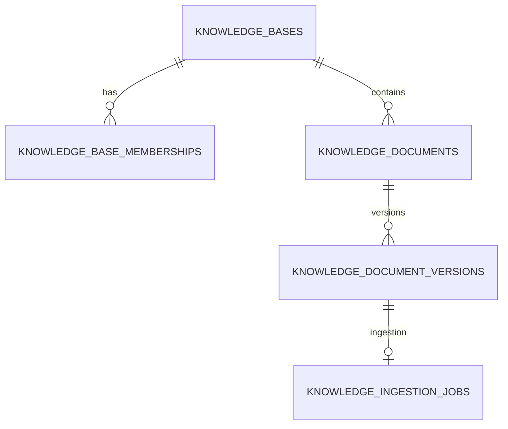
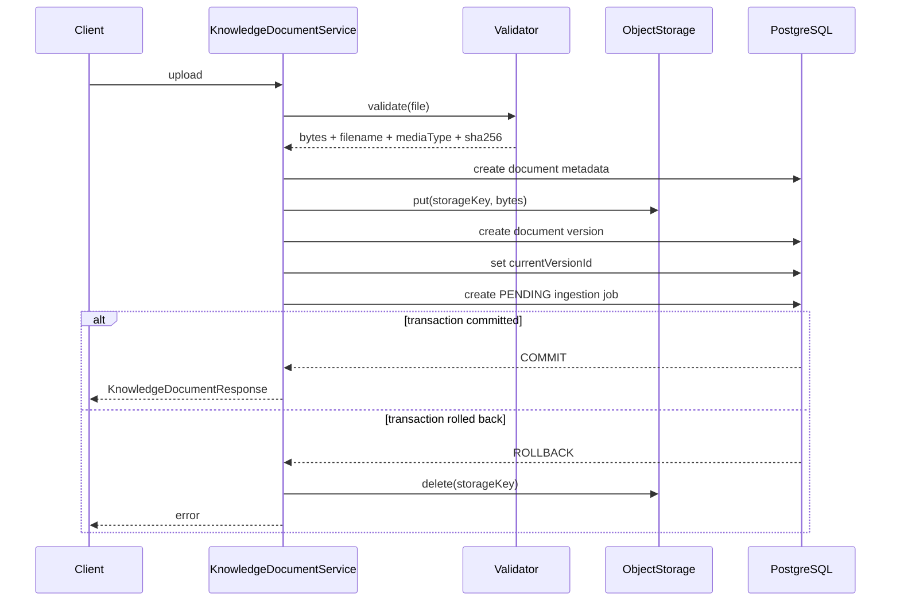
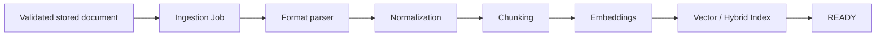

# SafeAI Desk — модуль Knowledge

> Архитектурная документация модуля корпоративных баз знаний SafeAI Desk.

## 1. Назначение

Модуль `knowledge` отвечает за хранение и управление корпоративными базами знаний и документами, которые в дальнейшем используются AI/RAG-контуром SafeAI Desk.

Модуль решает четыре основные задачи:

1. управление базами знаний;
2. разграничение доступа к базам знаний внутри организации;
3. загрузка, версионирование, безопасное хранение и скачивание документов;
4. подготовка документов к будущему ingestion pipeline: извлечение текста, chunking, embeddings и индексирование.

Текущая реализация уже содержит production-oriented контур загрузки, валидации, версионирования, PostgreSQL metadata и `LOCAL` / `S3` object storage.

При этом ingestion worker пока не реализован. Поэтому успешная загрузка документа означает:

```text
файл принят
→ проверен
→ сохранён в Object Storage
→ metadata/version сохранены в PostgreSQL
→ ingestion job создан со статусом PENDING
```

Статус `READY` нельзя выставлять искусственно: он должен появляться только после реальной обработки документа ingestion worker.

---

## 2. Границы модуля

Модуль находится в backend package:

```text
ru.safeai.gateway.knowledge
```

Он взаимодействует со следующими частями системы:

```text
Security
   │
   ▼
Knowledge Controllers
   │
   ▼
Knowledge Services
   ├──────────────► Audit
   │
   ├──────────────► PostgreSQL / JPA
   │
   └──────────────► ObjectStorage
                       ├── Local filesystem
                       └── S3 / MinIO
```

Frontend работает с модулем через REST API `/api/knowledge-bases/**`.

---

## 3. Архитектура верхнего уровня



Ключевой принцип: **PostgreSQL хранит бизнес-метаданные, а Object Storage хранит байты файлов**.

Исходное имя файла не используется как физический storage key.

---

## 4. Структура backend package

Рекомендуемое расположение этого README:

```text
backend/src/main/java/ru/safeai/gateway/knowledge/README.md
```

Структура модуля:

```text
knowledge/
├── controller/
│   ├── KnowledgeBaseController.java
│   └── KnowledgeDocumentController.java
│
├── dto/
│   ├── CreateKnowledgeBaseRequest.java
│   ├── UpdateKnowledgeBaseRequest.java
│   ├── CreateKnowledgeBaseMemberRequest.java
│   ├── UpdateKnowledgeBaseMemberRequest.java
│   ├── KnowledgeBaseResponse.java
│   ├── KnowledgeBasePageResponse.java
│   ├── KnowledgeBaseMemberResponse.java
│   ├── KnowledgeBaseMemberPageResponse.java
│   ├── KnowledgeMemberCandidateResponse.java
│   ├── KnowledgeDocumentResponse.java
│   └── KnowledgeDocumentPageResponse.java
│
├── entity/
│   ├── KnowledgeBaseEntity.java
│   ├── KnowledgeBaseMembershipEntity.java
│   ├── KnowledgeDocumentEntity.java
│   ├── KnowledgeDocumentVersionEntity.java
│   └── KnowledgeIngestionJobEntity.java
│
├── model/
│   ├── KnowledgeBaseVisibility.java
│   ├── KnowledgeBaseAccessLevel.java
│   └── KnowledgeIngestionStatus.java
│
├── repository/
│   ├── KnowledgeBaseRepository.java
│   ├── KnowledgeBaseMembershipRepository.java
│   ├── KnowledgeMemberDirectoryRepository.java
│   ├── KnowledgeDocumentRepository.java
│   ├── KnowledgeDocumentVersionRepository.java
│   └── KnowledgeIngestionJobRepository.java
│
├── service/
│   ├── KnowledgeBaseService.java
│   ├── KnowledgeDocumentService.java
│   ├── KnowledgeBaseNameNormalizer.java
│   ├── KnowledgeDocumentNameNormalizer.java
│   ├── KnowledgeNameNormalizerSupport.java
│   └── KnowledgeDocumentFileValidator.java
│
└── storage/
    ├── KnowledgeStorageType.java
    ├── KnowledgeStorageProperties.java
    ├── KnowledgeStorageConfiguration.java
    ├── ObjectStorage.java
    ├── StoredObject.java
    ├── LocalObjectStorage.java
    └── S3ObjectStorage.java
```

---

## 5. Назначение классов

### 5.1. Controller layer

#### `KnowledgeBaseController`

REST boundary для баз знаний.

Отвечает за:

- получение списка доступных баз;
- получение конкретной базы;
- создание и изменение базы;
- управление участниками базы;
- поиск кандидатов для добавления в membership;
- первичную role-based проверку endpoint.

Controller не должен содержать бизнес-логику доступа. Финальная авторизация выполняется в `KnowledgeBaseService`.

#### `KnowledgeDocumentController`

REST boundary для документов.

Отвечает за:

- список документов базы;
- multipart upload нового документа;
- загрузку новой версии существующего документа;
- скачивание текущей версии;
- скачивание конкретной версии.

При download controller формирует HTTP response на основе данных, возвращённых service/storage layer.

Для пользовательских файлов должен использоваться download-oriented ответ:

```text
Content-Disposition: attachment
X-Content-Type-Options: nosniff
```

Особенно важно не отдавать пользовательский HTML как same-origin inline page.

---

## 6. DTO layer

DTO отделяют REST contract от JPA entities.

### Базы знаний

`CreateKnowledgeBaseRequest`

```text
Создание базы:
- name
- description
- visibility
```

`UpdateKnowledgeBaseRequest`

```text
Изменение существующей базы:
- name
- description
- visibility
- enabled
- version
```

Поле `version` используется для optimistic concurrency control.

`KnowledgeBaseResponse`

Возвращает публичное представление базы знаний.

`KnowledgeBasePageResponse`

Пагинированный REST response для списка баз.

### Membership

`CreateKnowledgeBaseMemberRequest`

Добавление пользователя в базу с конкретным access level.

`UpdateKnowledgeBaseMemberRequest`

Изменение уровня доступа существующего участника.

`KnowledgeBaseMemberResponse`

Публичное представление membership.

`KnowledgeBaseMemberPageResponse`

Пагинированный список участников.

`KnowledgeMemberCandidateResponse`

Результат tenant-scoped поиска пользователей, которых можно добавить в базу.

### Документы

`KnowledgeDocumentResponse`

Содержит агрегированное представление:

```text
document metadata
+
current version metadata
+
current ingestion status
```

В response входят, в частности:

```text
id
knowledgeBaseId
name
enabled
version
currentVersionId
versionNumber
originalFilename
mediaType
sizeBytes
status
createdAt
updatedAt
```

`KnowledgeDocumentPageResponse`

Пагинированный список документов.

---

## 7. Domain model

### 7.1. `KnowledgeBaseVisibility`

Поддерживаются два режима.

#### `ORGANIZATION`

База видна пользователям той же организации.

Пользователь без явного membership получает implicit access:

```text
VIEWER
```

Это позволяет читать базу и скачивать документы, но не позволяет загружать новые документы.

#### `MEMBERS`

База доступна только пользователям, которым создан явный membership.

Отсутствие membership означает отсутствие доступа.

---

### 7.2. `KnowledgeBaseAccessLevel`

Иерархия доступа:

```text
VIEWER < EDITOR < OWNER
```

#### `VIEWER`

Разрешено:

```text
просматривать базу
просматривать список документов
скачивать доступные документы
```

Запрещено:

```text
загружать новый документ
создавать новую версию
управлять базой
```

#### `EDITOR`

Включает права `VIEWER` и дополнительно позволяет:

```text
загружать документы
загружать новые версии
```

#### `OWNER`

Максимальный уровень доступа внутри membership model.

Tenant `ADMIN` в service layer рассматривается как административный владелец базы без необходимости создавать отдельную membership-запись.

---

### 7.3. `KnowledgeIngestionStatus`

Жизненный цикл обработки документа:

```text
PENDING
VALIDATING
EXTRACTING
READY
FAILED
```

Семантика:

| Status | Значение |
|---|---|
| `PENDING` | файл сохранён и ожидает фоновой обработки |
| `VALIDATING` | ingestion worker выполняет дополнительную проверку |
| `EXTRACTING` | выполняется извлечение содержимого |
| `READY` | документ полностью обработан и может использоваться retrieval-контуром |
| `FAILED` | ingestion завершился ошибкой |

На текущем этапе worker отсутствует, поэтому нормальный результат upload — `PENDING`.

---

## 8. Persistence model

Основные таблицы PostgreSQL:

```text
knowledge_bases
knowledge_base_memberships
knowledge_documents
knowledge_document_versions
knowledge_ingestion_jobs
```

### Связи



### `knowledge_bases`

Хранит:

```text
tenant / organization scope
name
description
visibility
enabled
creator
optimistic version
timestamps
```

Имя базы уникально внутри организации без учёта регистра.

### `knowledge_base_memberships`

Связывает:

```text
knowledge base
+
organization
+
user
+
access level
```

Один пользователь не должен иметь две membership-записи для одной и той же базы.

### `knowledge_documents`

Логическая сущность документа.

Ключевые данные:

```text
id
organization_id
knowledge_base_id
name
enabled
current_version_id
created_by_user_id
version
created_at
updated_at
```

`KnowledgeDocumentEntity` не хранит байты файла.

### `knowledge_document_versions`

Неизменяемая версия содержимого документа.

Ключевые данные:

```text
id
organization_id
knowledge_base_id
document_id
version_number
original_filename
media_type
size_bytes
sha256
storage_key
created_by_user_id
created_at
```

Именно версия указывает на физический объект в Object Storage.

### `knowledge_ingestion_jobs`

Хранит состояние асинхронной обработки конкретной document version.

Минимально важная связь:

```text
document_version_id
organization_id
status
```

---

## 9. Почему Document и DocumentVersion разделены

Документ — это логическая сущность:

```text
"Регламент информационной безопасности"
```

Версия — конкретный immutable upload:

```text
v1 → 2026-08-01
v2 → 2026-08-15
v3 → 2026-09-10
```

Это позволяет:

- не перезаписывать старые файлы;
- иметь историю версий;
- скачивать конкретную версию;
- повторно индексировать отдельную версию;
- безопасно переключать `current_version_id`;
- хранить hash и storage key для каждой версии отдельно.

---

## 10. Service layer

### 10.1. `KnowledgeBaseService`

Главный application service для баз знаний.

Отвечает за:

```text
tenant isolation
role checks
visibility rules
membership rules
создание/изменение баз
поиск доступных баз
управление membership
поиск member candidates
optimistic concurrency
audit
обработку конфликтов DB constraints
```

Критический принцип:

```text
organizationId никогда не принимается от клиента как доверенное значение
```

Tenant scope берётся из:

```java
SafeAiUserPrincipal.getOrganizationId()
```

---

### 10.2. `KnowledgeDocumentService`

Оркестрирует весь document lifecycle.

Основные зависимости:

```text
KnowledgeBaseRepository
KnowledgeBaseMembershipRepository
KnowledgeDocumentRepository
KnowledgeDocumentVersionRepository
KnowledgeIngestionJobRepository
ObjectStorage
KnowledgeDocumentFileValidator
AuditEventService
```

Основные операции:

```text
list
uploadNew
uploadVersion
download current version
download explicit version
```

Service выполняет:

1. access-control;
2. нормализацию логического имени документа;
3. проверку конфликтов имени;
4. content validation;
5. построение storage key;
6. запись объекта;
7. создание version metadata;
8. обновление `current_version_id`;
9. создание ingestion job со статусом `PENDING`;
10. audit event;
11. compensation cleanup при rollback.

---

## 11. Нормализация имён

Логические имена базы и документа нормализуются независимо от исходного filename.

Используются:

```text
KnowledgeNameNormalizerSupport
KnowledgeBaseNameNormalizer
KnowledgeDocumentNameNormalizer
```

Основные правила:

```text
- значение не должно быть null;
- управляющие символы запрещены;
- Unicode whitespace схлопывается;
- внешние пробелы удаляются;
- пустая строка после нормализации запрещена;
- длина ограничена 255 Unicode code points.
```

Нормализатор должен оставаться отдельной ответственностью и не смешиваться с файловой валидацией.

---

## 12. Валидация загружаемых файлов

### `KnowledgeDocumentFileValidator`

Это security boundary между пользовательским upload и Object Storage.

Нельзя доверять:

```text
extension
client Content-Type
browser MIME
```

по отдельности.

Validator читает реальные байты файла и определяет/проверяет тип по содержимому.

### Ограничение размера

Текущий production limit:

```text
25 MiB
26_214_400 bytes
```

Размер проверяется до чтения и повторно после чтения фактических байтов.

---

## 13. Поддерживаемые форматы

Production whitelist:

```text
PDF
DOCX
TXT
HTML / HTM
MD
CSV
XLSX
PPTX
JSON
XML
```

Старые форматы пока намеренно не поддерживаются:

```text
DOC
XLS
PPT
RTF
ODT
ODS
```

### Проверки по форматам

#### PDF

Проверяется:

```text
начало: %PDF-
конец: наличие %%EOF в хвосте файла
```

Это upload-level structural validation, а не полный Adobe-compatible parser.

#### DOCX

Проверяется как OOXML ZIP:

```text
word/document.xml
[Content_Types].xml
правильный Word main content type
```

#### XLSX

Проверяется как OOXML ZIP:

```text
xl/workbook.xml
[Content_Types].xml
правильный Spreadsheet main content type
```

#### PPTX

Проверяется как OOXML ZIP:

```text
ppt/presentation.xml
[Content_Types].xml
правильный Presentation main content type
```

OOXML scanning дополнительно ограничивается по количеству ZIP entries и размеру `[Content_Types].xml`.

#### TXT

Требуется strict UTF-8.

Запрещены бинарные управляющие символы за исключением нормальных:

```text
TAB
CR
LF
```

#### HTML / HTM

Требуется корректный UTF-8.

Поддерживается UTF-8 BOM.

Upload validation проверяет HTML-структуру на уровне сигнатуры документа.

HTML хранится как пользовательский файл и скачивается как attachment. Его нельзя без дополнительной изоляции отображать inline на origin SafeAI.

#### Markdown

`MD` принимается как strict UTF-8 text document.

#### CSV

`CSV` принимается как strict UTF-8 text document.

Структурная семантика строк/колонок относится уже к ingestion parser, а не к upload validator.

#### JSON

Дополнительно выполняется строгая syntax validation.

Ограничена максимальная глубина вложенности:

```text
128
```

Validator не должен строить огромный object tree только ради upload-level проверки.

#### XML

Выполняется безопасная streaming validation.

Запрещены:

```text
DOCTYPE
ENTITY
external entities
DTD support
```

Это необходимо для защиты от:

```text
XXE
entity expansion
external resource access
```

---

## 14. Object Storage abstraction

Внешний контракт:

```text
ObjectStorage
```

реализации:

```text
LocalObjectStorage
S3ObjectStorage
```

Бизнес-сервис не должен знать, где физически лежит объект.

Это позволяет использовать:

```text
LOCAL → development / simple test environment
S3    → MinIO / AWS S3-compatible production storage
```

`StoredObject` переносит resource/content metadata из storage layer в service/controller.

---

## 15. Storage key

Физический ключ строится из UUID и не зависит от пользовательского filename:

```text
{organizationId}/{knowledgeBaseId}/{documentId}/{documentVersionId}
```

Пример:

```text
aaaaaaaa-aaaa-aaaa-aaaa-aaaaaaaaaaaa/
28ae4cac-2f14-42af-85e9-e3f1385a249f/
534f6ea3-595b-47be-a90a-6397a96d16b8/
ce73e260-0e85-47f0-9d3e-4bab1a833150
```

Именно поэтому в MinIO Console видны UUID, а не:

```text
04_Техническая_архитектура_SafeAI.pdf
```

Исходное имя хранится в PostgreSQL:

```text
knowledge_document_versions.original_filename
```

Это сделано намеренно.

Преимущества:

```text
- отсутствие коллизий одинаковых filename;
- Unicode filename не влияет на storage path;
- переименование logical document не требует move object;
- версия имеет собственный immutable key;
- пользовательский filename не участвует в path traversal;
- storage layer не становится источником бизнес-истины.
```

---

## 16. LOCAL storage

Конфигурация:

```yaml
safeai:
  knowledge:
    storage:
      type: local
      local-root: ./var/knowledge-objects
      max-upload-bytes: 26214400
```

Default root нормализуется к:

```text
var/knowledge-objects
```

LOCAL режим подходит для:

```text
unit/integration tests
локальной разработки
простого single-node окружения
```

Для production с несколькими backend instances предпочтителен S3-compatible storage.

---

## 17. S3 / MinIO storage

Конфигурация:

```yaml
safeai:
  knowledge:
    storage:
      type: s3
      max-upload-bytes: 26214400
      endpoint: http://localhost:9000
      access-key: safeai
      secret-key: safeai-local-change-me
      bucket: safeai-knowledge
```

`KnowledgeStorageProperties` содержит семь параметров:

```text
type
localRoot
maxUploadBytes
endpoint
accessKey
secretKey
bucket
```

В production-конфигурации нет implicit `autoCreateBucket`.

Bucket должен существовать до старта backend.

`S3ObjectStorage` выполняет fail-fast проверку bucket при инициализации. Ошибка конфигурации storage должна быть обнаружена при startup, а не при первом пользовательском upload.

### Локальный MinIO

Обычно:

```text
S3 API:       http://localhost:9000
MinIO Console http://localhost:9001
Bucket:       safeai-knowledge
```

Если backend запущен внутри Docker network, endpoint должен ссылаться на имя сервиса:

```text
http://minio:9000
```

---

## 18. Поведение `S3ObjectStorage`

Основные гарантии:

```text
put(key, resource)
get(key)
delete(key)
```

Дополнительно:

- blank storage key отклоняется до network call;
- отсутствующий S3 object преобразуется в `NoSuchFileException`;
- остальные S3 failures преобразуются в `IOException`;
- bucket проверяется на startup;
- `MinioClient` корректно закрывается при shutdown.

---

## 19. Транзакционная модель

PostgreSQL транзакционен.

S3 / filesystem — нет.

Поэтому upload требует compensation strategy.

Упрощённо:



Критический инвариант:

```text
если DB-транзакция откатилась после успешного storage.put(),
загруженный object не должен остаться orphan object.
```

---

## 20. Upload нового документа

Логический flow:

```text
POST multipart
   │
   ▼
KnowledgeDocumentController
   │
   ▼
KnowledgeDocumentService.uploadNew()
   │
   ├── authorize(EDITOR)
   ├── normalize document name
   ├── reject duplicate logical name
   ├── KnowledgeDocumentFileValidator.validate()
   ├── create KnowledgeDocumentEntity
   ├── build UUID storage key
   ├── ObjectStorage.put()
   ├── create KnowledgeDocumentVersionEntity
   ├── update currentVersionId
   ├── create KnowledgeIngestionJobEntity(PENDING)
   ├── AuditEventService
   └── response
```

Duplicate logical document name внутри одной базы возвращает conflict, например:

```text
Документ с таким названием уже существует.
```

---

## 21. Upload новой версии

Новая версия:

```text
не создаёт новый KnowledgeDocumentEntity
```

Вместо этого:

```text
existing document
   │
   ├── new immutable KnowledgeDocumentVersionEntity
   ├── new ObjectStorage object
   ├── currentVersionId → новая версия
   └── new PENDING ingestion job
```

Предыдущие версии сохраняются.

---

## 22. Download

Download разрешается только после service-level access check.

Service получает:

```text
KnowledgeDocumentEntity
→ KnowledgeDocumentVersionEntity
→ storageKey
→ ObjectStorage.get()
```

Controller возвращает файл с исходным filename из БД.

При скачивании текущей версии используется `current_version_id`.

При скачивании explicit version используется переданный `versionId`.

---

## 23. Access control

### Role layer

Knowledge — tenant data-plane.

Основные роли:

```text
ROLE_ADMIN
ROLE_USER
```

`ROLE_SUPER_ADMIN` не получает автоматический доступ к tenant Knowledge data plane только из-за своей платформенной роли.

Это важная граница между:

```text
platform administration
```

и:

```text
tenant corporate data
```

### Service-level authorization matrix

| Операция | VIEWER | EDITOR | OWNER | ADMIN |
|---|---:|---:|---:|---:|
| открыть доступную базу | ✅ | ✅ | ✅ | ✅ |
| список документов | ✅ | ✅ | ✅ | ✅ |
| скачать документ | ✅ | ✅ | ✅ | ✅ |
| загрузить новый документ | ❌ | ✅ | ✅ | ✅ |
| загрузить новую версию | ❌ | ✅ | ✅ | ✅ |
| управлять базой/members | ❌ | ❌ | по domain rules | ✅ |

`ORGANIZATION` visibility даёт обычному пользователю implicit `VIEWER`, но не `EDITOR`.

---

## 24. Tenant isolation

Каждый repository/service query должен быть scoped минимум по:

```text
organizationId
```

а для document operations также по:

```text
knowledgeBaseId
documentId
```

Плохой вариант:

```text
findById(documentId)
```

Предпочтительный вариант:

```text
findByIdAndKnowledgeBaseIdAndOrganizationId(...)
```

Это защищает от IDOR / cross-tenant data access даже при знании UUID чужого объекта.

---

## 25. Disabled resources

Отключённая база:

```text
ADMIN → может видеть и администрировать
USER  → должна выглядеть как недоступная / несуществующая
```

Такое поведение снижает утечку информации о скрытых tenant resources.

Для обычного пользователя disabled resource не должен просто возвращать данные с `enabled=false`, если пользователь не должен знать о его существовании.

---

## 26. Audit

Knowledge operations интегрированы с:

```text
AuditEventService
```

Audit фиксирует security/business значимые операции.

Например, создание документа записывает событие `KNOWLEDGE_DOCUMENT_CREATED`.

Audit payload должен содержать идентификаторы и безопасные metadata, но не байты файла и не содержимое документа.

---

## 27. REST API

Базовый namespace:

```http
/api/knowledge-bases
```

Основные endpoint-группы:

```http
GET    /api/knowledge-bases
GET    /api/knowledge-bases/{knowledgeBaseId}
POST   /api/knowledge-bases
PATCH  /api/knowledge-bases/{knowledgeBaseId}
```

Membership API располагается под конкретной базой знаний.

Document API:

```http
GET  /api/knowledge-bases/{knowledgeBaseId}/documents

POST /api/knowledge-bases/{knowledgeBaseId}/documents

POST /api/knowledge-bases/{knowledgeBaseId}/documents/{documentId}/versions

GET  /api/knowledge-bases/{knowledgeBaseId}/documents/{documentId}/download

GET  /api/knowledge-bases/{knowledgeBaseId}/documents/{documentId}/versions/{versionId}/download
```

Точный REST contract определяется controller/DTO и является source of truth при изменениях.

---

## 28. Frontend integration

Связанные frontend-файлы:

```text
frontend/src/
├── api/
│   ├── knowledgeApi.ts
│   ├── knowledgeDocumentApi.ts
│   └── http.ts
│
├── components/knowledge/
│   ├── KnowledgeBaseCard.tsx
│   ├── KnowledgeBaseFormModal.tsx
│   ├── KnowledgeMembersModal.tsx
│   └── KnowledgePagination.tsx
│
└── pages/
    ├── KnowledgePage.tsx
    ├── KnowledgePage.css
    ├── KnowledgeDetailsPage.tsx
    └── KnowledgeDetailsPage.css
```

### `KnowledgePage`

Отображает список баз знаний и операции управления базами.

### `KnowledgeDetailsPage`

Отображает:

```text
документы
версию
формат
статус ingestion
размер
дату обновления
download
upload new version
```

Исходный filename кликабелен и ведёт на безопасный download endpoint.

---

## 29. Error handling и Request ID

Frontend использует общий `ApiError` contract.

Для ожидаемых клиентских ошибок:

```text
400
409
413
429
```

показывается пользовательское сообщение без технического Request ID.

Пример:

```text
Документ с таким названием уже существует.
```

Для технических server/transport failures показывается:

```text
Не удалось загрузить файл.

Код запроса: <request-id>
```

Request ID нужен support/devops для корреляции UI error и backend logs.

Внутренние backend details нельзя раскрывать пользователю, если error code не включён в public allow-list.

---

## 30. Database migrations

Knowledge schema создавалась отдельными Flyway migrations.

Текущий архитектурный смысл:

```text
V38 → knowledge bases / memberships
V39 → documents / versions / ingestion jobs
```

Новые изменения схемы должны добавляться новой Flyway migration.

Запрещено редактировать уже применённые production migrations.

---

## 31. Тестовая архитектура

Knowledge должен покрываться несколькими уровнями тестов.

### Unit tests

Примеры:

```text
KnowledgeBaseServiceTest
KnowledgeDocumentServiceTest
KnowledgeDocumentFileValidatorTest
KnowledgeBaseNameNormalizerTest
KnowledgeDocumentNameNormalizerTest
```

Проверяют isolated business rules.

### MVC / security tests

```text
KnowledgeControllerSecurityTest
```

Проверяет:

```text
authentication
ROLE_USER / ROLE_ADMIN
запрет SUPER_ADMIN как implicit tenant user
pagination validation
multipart endpoint
HTTP status contract
```

### PostgreSQL integration

```text
KnowledgePersistenceIntegrationTest
KnowledgeAccessControlIntegrationTest
```

Проверяют:

```text
реальные constraints
tenant isolation
visibility
membership
optimistic concurrency
document/version persistence
PENDING ingestion job
```

### S3 E2E

```text
KnowledgeS3EndToEndIntegrationTest
```

Использует Testcontainers + MinIO и проверяет полный путь:

```text
service
→ PostgreSQL metadata
→ MinIO object
→ download
→ byte-for-byte round trip
```

Отдельно должен проверяться rollback cleanup уже загруженного S3 object.

---

## 32. Рекомендуемые команды проверки

Backend targeted tests:

```bash
./mvnw -Dtest=KnowledgeDocumentFileValidatorTest test
```

Все Knowledge tests:

```bash
./mvnw -Dtest='ru.safeai.gateway.knowledge.**' test
```

Полный backend regression:

```bash
./mvnw test
```

Frontend:

```bash
npm test -- --run
npm run build
```

S3 E2E требует Docker/Testcontainers.

---

## 33. Инварианты, которые нельзя ломать

### Security

```text
1. Tenant scope всегда берётся из authenticated principal.
2. Нельзя доверять client Content-Type.
3. Нельзя определять доступ только на controller layer.
4. Нельзя давать SUPER_ADMIN implicit доступ к tenant Knowledge.
5. Нельзя inline-render пользовательского HTML на origin приложения.
6. XML DTD/external entities должны оставаться запрещёнными.
```

### Storage

```text
1. UUID storage key не заменяется пользовательским filename.
2. original_filename остаётся metadata в PostgreSQL.
3. S3 bucket должен существовать до startup backend.
4. DB rollback после storage.put() должен удалять orphan object.
5. Missing object должен отличаться от generic S3 failure.
```

### Versioning

```text
1. Новая версия не должна перезаписывать старый object.
2. version_number должен монотонно увеличиваться.
3. current_version_id должен указывать на актуальную версию.
4. SHA-256 хранится для каждой версии.
```

### Ingestion

```text
1. Upload success != READY.
2. READY допустим только после реальной обработки.
3. Ingestion failure должен переводить job в FAILED.
4. Переиндексация должна быть привязана к конкретной version.
```

---

## 34. Текущий технический долг / следующий этап

Главный отсутствующий компонент:

```text
Knowledge Ingestion Worker
```

Целевая архитектура:



Будущие parser strategies:

```text
PDF  → text + layout aware extraction
DOCX → paragraphs + headings + tables
TXT  → plain text
HTML → DOM text extraction, scripts/styles excluded
MD   → headings/lists/code-aware parsing
CSV  → table-aware rows/columns
XLSX → sheets/tables/cells
PPTX → slide text + notes + tables
JSON → path-preserving structured flattening
XML  → element/path-aware structured extraction
```

---

## 35. Планируемая модель retrieval

После ingestion модуль должен предоставлять подготовленные chunks retrieval layer, а не заставлять chat service читать raw files.

Целевой поток:

```text
Chat question
   │
   ▼
Knowledge access scope
   │
   ▼
Hybrid retrieval
   ├── vector similarity
   └── lexical / keyword search
   │
   ▼
authorized chunks
   │
   ▼
LLM context
```

Retrieval обязательно должен сохранять:

```text
organizationId
knowledgeBaseId
documentId
documentVersionId
chunkId
source metadata
```

чтобы исключить cross-tenant и cross-KB leakage.

---

## 36. Как добавлять новый формат файла

Новый формат нельзя добавлять только в `<input accept>` frontend.

Минимальный production checklist:

```text
1. Добавить extension в backend whitelist.
2. Добавить canonical media type.
3. Реализовать content-level validation.
4. Проверить extension/content mismatch.
5. Добавить positive fixture.
6. Добавить malformed/negative fixtures.
7. Добавить security tests для parser attack surface.
8. Добавить frontend accept.
9. Добавить frontend type badge.
10. Добавить ingestion parser.
11. Добавить integration test.
12. Обновить этот README.
```

До появления ingestion parser файл может быть принят и храниться в `PENDING`, но это должно быть явно осознанным архитектурным решением.

---

## 37. Как добавлять новый storage backend

Новая реализация должна реализовать:

```java
ObjectStorage
```

и соблюдать существующую семантику:

```text
put
get
delete
missing-object mapping
resource lifecycle
rollback compensation compatibility
```

`KnowledgeDocumentService` не должен зависеть от SDK конкретного storage provider.

---

## 38. Observability

Для диагностики Knowledge полезны:

```text
requestId
organizationId
knowledgeBaseId
documentId
documentVersionId
storage operation
ingestion status
```

Нельзя логировать:

```text
secretKey
полные credentials
содержимое корпоративных документов
чувствительные upload bytes
```

Storage exceptions должны содержать достаточно технического контекста для backend logs, но REST response не должен раскрывать внутренние детали инфраструктуры.

---

## 39. Production checklist

Перед production deployment необходимо проверить:

```text
[ ] PostgreSQL migrations применены
[ ] S3/MinIO endpoint доступен backend
[ ] bucket существует
[ ] access key имеет минимально необходимые права
[ ] secret key не хранится в git
[ ] max-upload-bytes задан ожидаемо
[ ] reverse proxy допускает upload >= backend limit
[ ] HTML скачивается attachment, а не inline
[ ] full Knowledge tests зелёные
[ ] S3 E2E зелёный
[ ] backup policy учитывает PostgreSQL и Object Storage совместно
[ ] lifecycle policy S3 не удаляет активные document versions
```

После реализации ingestion worker дополнительно:

```text
[ ] worker имеет retry policy
[ ] job lease/fencing исключает двойную обработку
[ ] FAILED сохраняет безопасную диагностику
[ ] READY выставляется атомарно после завершения index write
[ ] reindex не ломает текущий serving index
```

---

## 40. Краткая модель ответственности

```text
Controller
    HTTP / validation boundary
        │
        ▼
Service
    business rules / authorization / transaction orchestration
        │
        ├──────────► Repository
        │             PostgreSQL metadata
        │
        ├──────────► Validator
        │             untrusted file boundary
        │
        ├──────────► ObjectStorage
        │             raw immutable bytes
        │
        └──────────► Audit
                      security/business trace
```

Главный архитектурный принцип модуля:

> **Бизнес-истиной является PostgreSQL metadata, raw file хранится в Object Storage, а доступ к обоим всегда проходит через tenant-aware service layer.**

---

## 41. Статус реализации

На текущем этапе реализовано:

```text
✅ Knowledge Base CRUD
✅ ORGANIZATION / MEMBERS visibility
✅ VIEWER / EDITOR / OWNER access model
✅ Membership management
✅ Tenant isolation
✅ Document upload
✅ Immutable document versions
✅ Current version pointer
✅ LOCAL Object Storage
✅ S3 / MinIO Object Storage
✅ Fail-fast S3 bucket validation
✅ Rollback compensation
✅ SHA-256 per version
✅ Safe download
✅ 10-format production whitelist
✅ JSON / XML security validation
✅ Audit integration
✅ PostgreSQL integration tests
✅ S3 E2E tests
✅ Frontend Knowledge pages
✅ User-friendly upload errors
✅ Technical Request ID policy

⏳ Ingestion worker
⏳ Text/table extraction
⏳ Chunking
⏳ Embeddings
⏳ Vector / hybrid indexing
⏳ Knowledge-aware RAG retrieval
```

---

## 42. Итог

`knowledge` — отдельный tenant-aware application module, который уже обеспечивает надёжный контур:

```text
управление базой
→ authorization
→ upload
→ security validation
→ immutable versioning
→ PostgreSQL metadata
→ LOCAL/S3 storage
→ audit
→ safe download
→ PENDING ingestion job
```

Следующее архитектурное расширение должно происходить **после `KnowledgeIngestionJobEntity`**, а не внутри upload controller/service.

Это позволяет сохранить текущий upload path быстрым, транзакционно понятным и независимым от тяжёлого parsing/embedding процесса.
