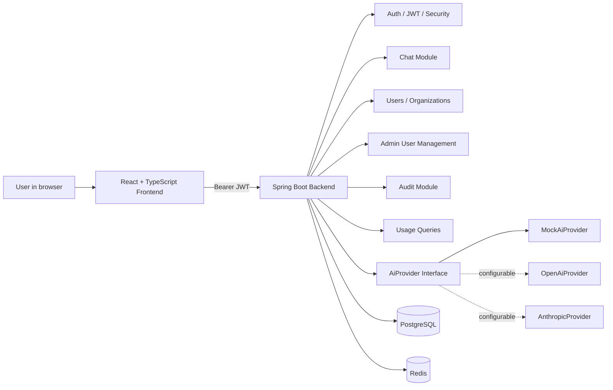
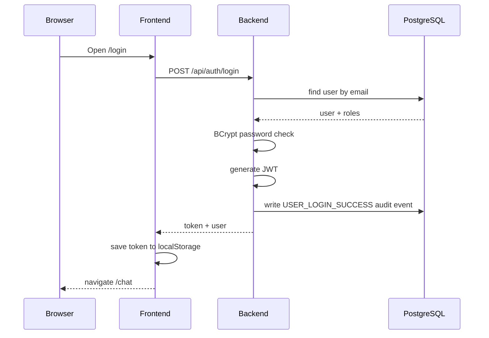
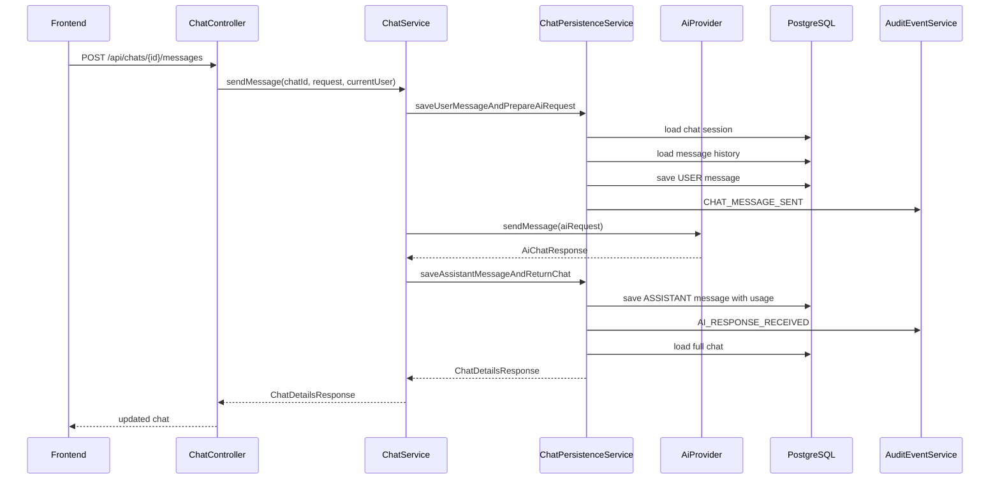
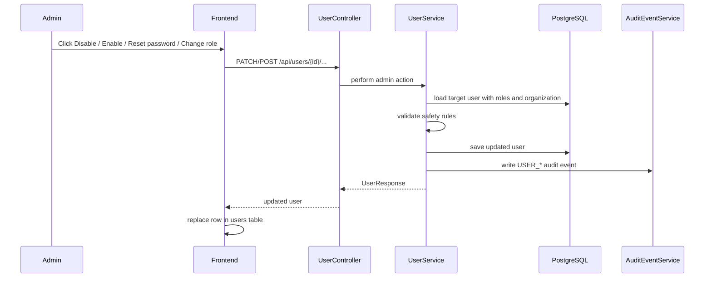
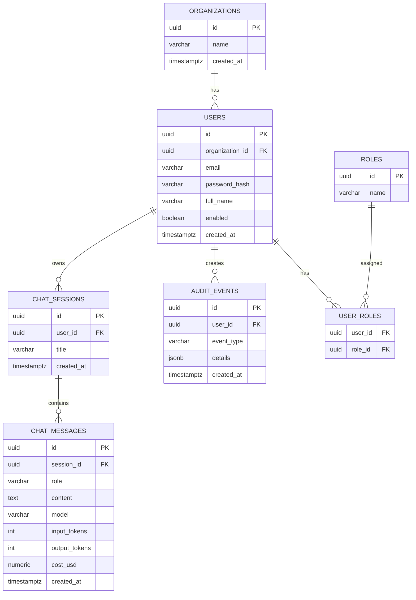

# SafeAI Desk — Roadmap

## 1. Цель проекта

SafeAI Desk — это корпоративный AI Gateway: внутренняя прослойка между сотрудниками компании и внешними AI-провайдерами.

Главная идея:

```text
Employees
  ↓
SafeAI Desk
  ↓
Auth / Roles / User Management / Audit / Usage / Limits / Provider Switch / Future RAG
  ↓
AI Providers
```

Проект нужен, чтобы организация могла:

```text
- контролировать доступ пользователей к AI;
- управлять пользователями и ролями;
- отключать пользователей без удаления истории;
- сбрасывать забытые пароли;
- хранить историю чатов;
- видеть аудит действий;
- считать usage по токенам и стоимости;
- переключать AI-провайдеров;
- ограничивать потребление через лимиты;
- позже подключить документы и RAG.
```

---

## 2. Текущий статус

Проект уже доведён до рабочего full-stack MVP.

Сейчас реально работает сценарий:

```text
Login
  ↓
JWT token
  ↓
React frontend
  ↓
Create chat
  ↓
Send message
  ↓
AiProvider
  ↓
MockAiProvider / future OpenAI / future Anthropic
  ↓
Save USER and ASSISTANT messages
  ↓
Save usage fields
  ↓
Write audit events
  ↓
Admin checks Users / Audit / Usage
  ↓
Admin manages users: enable/disable, reset password, change roles
```

Текущая рабочая связка:

```text
Frontend: http://localhost:5173
Backend:  http://localhost:8080
Database: PostgreSQL localhost:5432/safeai
Redis:    localhost:6379
```

---

## 3. Что уже сделано

### Infrastructure

```text
✅ Docker Compose
✅ PostgreSQL 16
✅ Redis 7
✅ Local development mode
✅ Flyway migrations
✅ PostgreSQL volume-based persistence
```

### Backend foundation

```text
✅ Java 21
✅ Spring Boot 4
✅ Spring Web MVC
✅ Spring Security
✅ OAuth2 Resource Server JWT
✅ Spring Data JPA
✅ Flyway
✅ Maven
✅ Centralized JSON error responses
✅ Stateless security
```

### Database

```text
✅ organizations
✅ users
✅ roles
✅ user_roles
✅ chat_sessions
✅ chat_messages
✅ audit_events
✅ usage fields in chat_messages
✅ jsonb details for audit events
✅ timestamptz migration for created_at fields
✅ indexes for common query paths
✅ unique organization name index
```

### Auth and security

```text
✅ BCrypt password hashing
✅ POST /api/auth/login
✅ GET /api/auth/me
✅ JWT generation
✅ JWT decoding
✅ SafeAiUserPrincipal
✅ ADMIN / USER roles
✅ Protected backend endpoints
✅ Role-aware frontend navigation
✅ Current user display in topbar
✅ JSON 401 response
✅ JSON 403 response
✅ Method security tests
```

### Organization and user modules

```text
✅ Organization API
✅ User API
✅ Create organization
✅ Create user
✅ List users
✅ List organizations
✅ Role assignment
✅ Duplicate email protection
✅ Missing organization validation
✅ Enable / Disable user
✅ Reset user password
✅ Change user roles
✅ Protection from disabling yourself
✅ Protection from removing your own ADMIN role
✅ Protection from disabling the last active ADMIN
✅ Protection from removing ADMIN role from the last active ADMIN
```

### Chat module

```text
✅ Chat sessions
✅ Chat messages
✅ Create chat
✅ List chats
✅ Get chat details
✅ Send message
✅ Save USER message
✅ Save ASSISTANT message
✅ Split persistence around external AI call
```

### AI module

```text
✅ AiProvider interface
✅ AiChatRequest
✅ AiChatResponse
✅ AiMessage
✅ MockAiProvider
✅ AiProviderSupport
✅ OpenAiProvider scaffold
✅ AnthropicProvider scaffold
✅ Configurable provider switch through environment variables
```

Важно: `MockAiProvider` проверен локально. `OpenAiProvider` и `AnthropicProvider` уже заложены архитектурно, но live-проверка требует реальных API keys.

### Audit module

```text
✅ AuditEventEntity
✅ AuditEventService
✅ AuditEventQueryService
✅ Admin audit endpoints
✅ USER_LOGIN_SUCCESS
✅ USER_LOGIN_FAILED
✅ CHAT_CREATED
✅ CHAT_MESSAGE_SENT
✅ AI_RESPONSE_RECEIVED
✅ AI_RESPONSE_FAILED
✅ USER_CREATED
✅ ORGANIZATION_CREATED
✅ USER_ENABLED_CHANGED
✅ USER_ROLES_CHANGED
✅ USER_PASSWORD_RESET
```

### Usage module

```text
✅ model
✅ inputTokens
✅ outputTokens
✅ totalTokens
✅ costUsd
✅ usage by user and model
✅ usage by user
✅ usage by model
✅ daily usage
✅ usage by userId
✅ usage by organizationId
```

### Frontend MVP

```text
✅ React
✅ TypeScript
✅ Vite
✅ React Router
✅ Fetch API layer
✅ JWT storage in localStorage
✅ Login page
✅ Login loading state
✅ Login error message cleanup
✅ Chat page
✅ Admin Users page
✅ Create user form
✅ Confirm password field
✅ User filters: All / Admins / Users
✅ User action buttons: Enable / Disable / Reset password / Make ADMIN / Make USER
✅ Role badges and enabled/disabled badges
✅ Current user email and role in topbar
✅ Admin menu hidden for USER
✅ Admin Audit page
✅ Admin Usage page
✅ Logout
✅ Protected routes
✅ Admin-only frontend routes
✅ Token cleanup on 401
```

---

## 4. Реализованные backend endpoints

### Auth

```text
POST /api/auth/login
GET  /api/auth/me
```

### Organizations

```text
POST /api/organizations
GET  /api/organizations
GET  /api/organizations/{id}
```

### Users

```text
POST  /api/users
GET   /api/users
GET   /api/users/{id}
PATCH /api/users/{id}/enabled
PATCH /api/users/{id}/roles
POST  /api/users/{id}/reset-password
```

Назначение новых user-management endpoints:

```text
PATCH /api/users/{id}/enabled        включает или отключает пользователя
PATCH /api/users/{id}/roles          меняет роль USER / ADMIN
POST  /api/users/{id}/reset-password задаёт новый пароль, если старый забыт
```

Физическое удаление пользователей пока не реализовано намеренно. Вместо удаления используется `enabled=false`, чтобы не ломать историю чатов, usage и audit.

### Chats

```text
POST /api/chats
GET  /api/chats
GET  /api/chats/{id}
POST /api/chats/{id}/messages
```

### Admin Audit

```text
GET /api/admin/audit-events
GET /api/admin/audit-events/users/{userId}
```

### Admin Usage

```text
GET /api/admin/usage-summary
GET /api/admin/usage/summary
GET /api/admin/usage/users
GET /api/admin/usage/models
GET /api/admin/usage/daily
GET /api/admin/usage/by-user/{userId}
GET /api/admin/usage/by-organization/{organizationId}
```

`/api/admin/usage-summary` оставлен как совместимый старый endpoint. Новый основной endpoint:

```text
GET /api/admin/usage/summary
```

---

## 5. Frontend pages

```text
/login
/chat
/admin/users
/admin/audit
/admin/usage
```

Текущий browser-flow для ADMIN:

```text
http://localhost:5173
  ↓
/login
  ↓
admin@test.com / admin123
  ↓
/chat
  ↓
Create chat
  ↓
Send message
  ↓
Mock AI response
  ↓
/admin/users
  ↓
Create user / Disable user / Reset password / Change role
  ↓
/admin/audit
/admin/usage
```

Текущий browser-flow для USER:

```text
/login
  ↓
USER email/password
  ↓
/chat
```

Обычный USER не видит в topbar пункты:

```text
Users
Audit
Usage
```

Если USER вручную откроет `/admin/users`, frontend должен вернуть его на `/chat`, а backend всё равно защищает admin endpoints через `403 FORBIDDEN`.

---

## 6. Текущая архитектурная схема



---

## 7. Auth flow



---

## 8. Chat message flow



---

## 9. Admin user-management flow



Что защищает backend:

```text
- ADMIN не может отключить самого себя;
- ADMIN не может снять ADMIN-роль с самого себя;
- нельзя отключить последнего активного ADMIN;
- нельзя снять ADMIN-роль с последнего активного ADMIN;
- обычный USER не имеет доступа к этим endpoints.
```

---

## 10. Database high-level schema



---

## 11. Текущий рабочий сценарий MVP

### 11.1 Login

```text
User opens /login
  ↓
enters admin@test.com / admin123
  ↓
frontend calls POST /api/auth/login
  ↓
backend returns JWT
  ↓
frontend stores token in localStorage.safeai_token
  ↓
user is redirected to /chat
```

### 11.2 Chat

```text
User clicks Create chat
  ↓
frontend calls POST /api/chats
  ↓
backend creates chat session
  ↓
audit event CHAT_CREATED is written
```

```text
User sends message
  ↓
frontend calls POST /api/chats/{id}/messages
  ↓
backend saves USER message
  ↓
backend calls AiProvider
  ↓
MockAiProvider returns response
  ↓
backend saves ASSISTANT message
  ↓
usage fields are saved
  ↓
audit events are written
```

### 11.3 Admin Users

```text
ADMIN opens /admin/users
  ↓
frontend calls GET /api/users
  ↓
admin sees users table
  ↓
admin can create user
  ↓
admin can disable/enable user
  ↓
admin can reset password
  ↓
admin can change role USER / ADMIN
```

### 11.4 Admin Audit

Expected events after login + chat creation + message + user-management actions:

```text
USER_LOGIN_SUCCESS
CHAT_CREATED
CHAT_MESSAGE_SENT
AI_RESPONSE_RECEIVED
USER_CREATED
USER_ENABLED_CHANGED
USER_ROLES_CHANGED
USER_PASSWORD_RESET
```

### 11.5 Admin Usage

Expected usage fields:

```text
userEmail
model
inputTokens
outputTokens
totalTokens
costUsd
```

Example:

```json
[
  {
    "userId": "bbbbbbbb-bbbb-bbbb-bbbb-bbbbbbbbbbbb",
    "userEmail": "admin@test.com",
    "model": "mock-safeai",
    "inputTokens": 26,
    "outputTokens": 61,
    "totalTokens": 87,
    "costUsd": 0.000000
  }
]
```

---

## 12. Текущие команды запуска

### 12.1 Infrastructure

```bat
cd /d "D:\Java projects\Safeai-desk\infra"
docker compose up -d postgres redis
```

Проверка:

```bat
docker ps
```

Ожидаемые контейнеры:

```text
safeai-postgres
safeai-redis
```

### 12.2 Backend

```bat
cd /d "D:\Java projects\Safeai-desk\backend"

set SAFEAI_JWT_SECRET=safeai-local-development-secret-key-change-this-value-please-123456789
set SAFEAI_JWT_EXPIRATION_MINUTES=60
set SAFEAI_AI_PROVIDER=mock

mvnw.cmd spring-boot:run
```

Проверка:

```bat
curl -i http://localhost:8080/actuator/health
```

Ожидаемо:

```json
{"groups":["liveness","readiness"],"status":"UP"}
```

### 12.3 Frontend

```bat
cd /d "D:\Java projects\Safeai-desk\frontend"
npm run dev
```

Открыть:

```text
http://localhost:5173/login
```

### 12.4 Frontend build

```bat
cd /d "D:\Java projects\Safeai-desk\frontend"
npm run build
```

Ожидаемо:

```text
✓ built in ...
```

---

## 13. Environment variables

### Local mock mode

```env
SAFEAI_JWT_SECRET=safeai-local-development-secret-key-change-this-value-please-123456789
SAFEAI_JWT_EXPIRATION_MINUTES=60

SAFEAI_AI_PROVIDER=mock

OPENAI_BASE_URL=https://api.openai.com/v1
OPENAI_API_KEY=
OPENAI_MODEL=gpt-4.1

ANTHROPIC_BASE_URL=https://api.anthropic.com/v1
ANTHROPIC_API_KEY=
ANTHROPIC_MODEL=claude-opus-4-8
ANTHROPIC_VERSION=2023-06-01
ANTHROPIC_MAX_TOKENS=1024
```

### OpenAI mode

```env
SAFEAI_AI_PROVIDER=openai
OPENAI_API_KEY=sk-...
OPENAI_MODEL=gpt-4.1
```

### Anthropic mode

```env
SAFEAI_AI_PROVIDER=anthropic
ANTHROPIC_API_KEY=sk-ant-...
ANTHROPIC_MODEL=claude-opus-4-8
ANTHROPIC_MAX_TOKENS=1024
```

---

## 14. Проверки перед коммитом

### Backend tests

```bat
cd /d "D:\Java projects\Safeai-desk\backend"
mvnw.cmd clean test
```

Ожидаемо:

```text
BUILD SUCCESS
```

### Frontend build

```bat
cd /d "D:\Java projects\Safeai-desk\frontend"
npm run build
```

Ожидаемо:

```text
✓ built in ...
```

### Manual smoke test

```text
1. Docker: postgres + redis running
2. Backend: localhost:8080
3. Frontend: localhost:5173
4. Login: admin@test.com / admin123
5. Check current user in topbar
6. Create chat
7. Send message
8. Check /admin/users
9. Create test USER
10. Disable test USER
11. Enable test USER
12. Reset password for test USER
13. Change USER to ADMIN and back to USER
14. Check /admin/audit
15. Check /admin/usage
16. Logout
17. Open /chat without token → redirect to /login
18. Login as USER → only Chat menu is visible
```

### Git status

```bat
cd /d "D:\Java projects\Safeai-desk"
git status
```

Не должны попадать в Git:

```text
frontend/node_modules/
frontend/dist/
backend/target/
backend/.env
.env
.idea/
API keys
production secrets
temporary files
docs/local/
*.local.md
```

---

## 15. Критерий готовности текущего MVP

Текущий MVP считается рабочим, если:

```text
✅ PostgreSQL и Redis запускаются через Docker Compose
✅ Backend стартует на localhost:8080
✅ /actuator/health возвращает UP
✅ Login работает через admin@test.com / admin123
✅ JWT сохраняется на frontend
✅ Frontend стартует на localhost:5173
✅ /chat защищен от неавторизованного доступа
✅ /chat открывается после login
✅ Можно создать чат
✅ Можно отправить сообщение
✅ MockAiProvider возвращает ответ
✅ Сообщения сохраняются в БД
✅ Usage-поля сохраняются в chat_messages
✅ Audit events пишутся
✅ /admin/users отображает пользователей
✅ /admin/users позволяет создавать пользователей
✅ /admin/users позволяет отключать и включать пользователей
✅ /admin/users позволяет сбрасывать пароль
✅ /admin/users позволяет менять роль USER / ADMIN
✅ /admin/users фильтрует All / Admins / Users
✅ Topbar показывает текущий email и роль
✅ USER не видит admin menu
✅ /admin/audit отображает события
✅ /admin/usage отображает usage summary
✅ npm run build проходит
✅ mvnw.cmd clean test проходит
```

---

## 16. Что дальше

### Next stage: Rate limits через Redis

Это следующий логичный этап.

Причины:

```text
- Redis уже есть в infrastructure;
- JWT уже содержит userId и organizationId;
- /api/chats/{id}/messages — точка потребления AI;
- usage уже считается;
- можно ограничивать количество AI-запросов до вызова AI provider.
```

Минимальная цель:

```text
Ограничить количество AI-запросов пользователя за период времени.
```

Первый вариант правила:

```text
USER: 20 AI-сообщений в час
ADMIN: 100 AI-сообщений в час или без ограничения
```

Минимальные backend-задачи:

```text
1. Добавить RateLimitProperties.
2. Добавить RedisRateLimitService.
3. Добавить RateLimitExceededException.
4. Подключить проверку перед вызовом AiProvider.
5. При превышении лимита возвращать HTTP 429.
6. Писать audit event RATE_LIMIT_EXCEEDED.
7. Добавить unit tests и controller/security tests.
```

Возможные будущие endpoints:

```text
GET /api/admin/limits
PUT /api/admin/limits
GET /api/admin/limits/usage
```

На первом этапе UI не обязателен.

---

## 17. После Rate Limits

Рекомендуемый порядок:

```text
1. Rate limits through Redis                         next
2. Token revocation / force logout through Redis     pending
3. Live OpenAI provider verification                 pending
4. Live Anthropic provider verification              pending
5. Provider error handling and retries               pending
6. Provider timeout configuration                    pending
7. Better frontend error rendering                   pending
8. Admin usage charts                                pending
9. Document upload                                   pending
10. RAG indexing                                     pending
11. RAG retrieval                                    pending
12. Production Docker profile                        pending
13. CI pipeline                                      pending
14. Deployment docs                                  pending
```

---

## 18. High-level roadmap

```text
1. Infrastructure                         ✅ done
2. Database + Flyway                      ✅ done
3. Organization API                       ✅ done
4. User API                               ✅ done
5. Auth/JWT                               ✅ done
6. Chat Core                              ✅ done
7. AI Provider abstraction                ✅ done
8. Mock AI Provider                       ✅ done
9. OpenAI provider scaffold               ✅ done
10. Anthropic provider scaffold           ✅ done
11. Audit events                          ✅ done
12. Admin Audit API                       ✅ done
13. Usage tracking                        ✅ done
14. Admin Usage APIs                      ✅ done
15. Common security hardening             ✅ done
16. React frontend MVP                    ✅ done
17. Protected frontend routes             ✅ done
18. Admin user management backend         ✅ done
19. Admin user management frontend        ✅ done
20. Role-aware frontend navigation        ✅ done
21. Frontend build verification           ✅ done
22. Rate limits through Redis             ➡️ next
23. Token revocation / force logout       pending
24. Live provider verification            pending
25. Documents upload                      pending
26. RAG                                   pending
27. Admin dashboards                      pending
28. Production deployment                 pending
```

---

## 19. Формулировка для собеседования

```text
Я делаю backend-first MVP корпоративного AI Gateway и уже довёл его до рабочего full-stack MVP. На backend реализованы организации, пользователи, роли, JWT-авторизация, чат, абстракция AI-провайдера, mock provider, заготовки OpenAI/Anthropic providers, аудит действий и учет usage по токенам/стоимости. Чат не зависит от конкретного AI-провайдера: он работает через интерфейс AiProvider.

Для админа реализованы endpoints для пользователей, audit events и usage-аналитики. Кроме создания и просмотра пользователей, добавлены admin user-management actions: enable/disable, reset password и смена ролей USER/ADMIN. Для безопасности backend запрещает отключить самого себя, снять с себя ADMIN и оставить систему без активного администратора. Все такие действия пишутся в audit.

Usage данные сохраняются в chat_messages и агрегируются по пользователю, модели и дням. Также сделан React + TypeScript frontend на Vite: login, chat, admin users, admin audit и admin usage. Frontend показывает текущего пользователя и роль, скрывает admin menu для обычного USER и позволяет администратору управлять пользователями через UI. Сейчас следующий этап — rate limiting через Redis, затем token revocation, live-проверка реальных AI-провайдеров и RAG.
```

---

## 20. Локальное подключение к PostgreSQL

```text
Name: SafeAI PostgreSQL Local
Host: localhost
Port: 5432
User: safeai
Password: safeai_password
Database: safeai
```

---

## 21. Локальные тестовые аккаунты

Для локальной разработки можно хранить личную напоминалку с тестовыми паролями здесь:

```text
docs/local/TEST_ACCOUNTS.local.md
```

Этот файл нельзя коммитить. В `.gitignore` должны быть строки:

```gitignore
docs/local/
*.local.md
```

Пароли в основной документации и production-конфигурации хранить нельзя. В базе пароли должны храниться только как BCrypt hashes.
